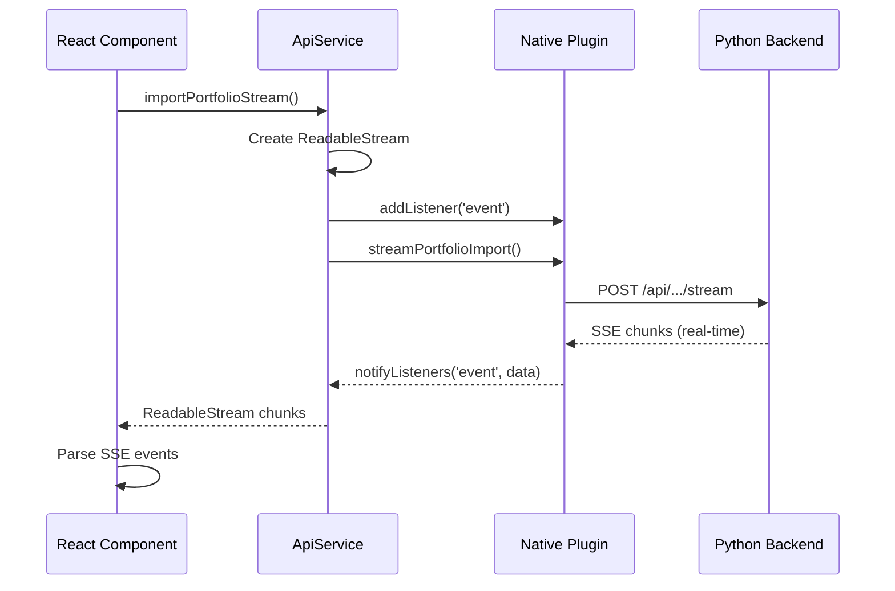

# Native Streaming Best Practices

> Guidelines for implementing Server-Sent Events (SSE) streaming on iOS and Android with Capacitor.
> Last updated: February 2026

## Overview

Native platforms (iOS/Android) require special handling for streaming responses because:

1. **WKWebView buffers fetch() responses**: On iOS, `fetch()` response bodies are buffered and may not deliver chunks incrementally, breaking real-time SSE streaming.
2. **Android WebView limitations**: Similar buffering behavior can occur on Android WebView.

**Solution**: Use native plugins that perform HTTP requests directly and emit events via Capacitor's event system.

## Architecture Pattern



## Implementation Checklist

### 1. Native Plugin (iOS/Android)

**Required methods:**
- `stream{Feature}()` - Starts the HTTP request and emits events
- Emit events via `notifyListeners("eventName", data)` for each SSE line
- Resolve promise when stream completes

**iOS Example:**
```swift
@objc func streamPortfolioImport(_ call: CAPPluginCall) {
    // ... setup request ...
    streamCall = call
    streamBuffer = ""
    streamSession = makeStreamSession()
    streamTask = streamSession?.dataTask(with: request)
    streamTask?.resume()
}

// URLSessionDataDelegate
public func urlSession(_ session: URLSession, dataTask: URLSessionDataTask, didReceive data: Data) {
    if let str = String(data: data, encoding: .utf8) {
        streamBuffer += str
        parseSSELinesAndEmit() // Emits via notifyListeners
    }
}

public func urlSession(_ session: URLSession, task: URLSessionTask, didCompleteWithError error: Error?) {
    call.resolve(["success": true])
}
```

**Android Example:**
```kotlin
@PluginMethod
fun streamPortfolioImport(call: PluginCall) {
    // ... setup request ...
    Thread {
        val response = httpClient.newCall(request).execute()
        response.body?.byteStream()?.use { stream ->
            BufferedReader(InputStreamReader(stream)).use { reader ->
                var line: String?
                while (reader.readLine().also { line = it } != null) {
                    if (line!!.startsWith("data: ")) {
                        val jsonStr = line.substring(6)
                        emitPortfolioStreamEvent(JSObject(jsonStr))
                    }
                }
            }
        }
        bridge.runOnUiThread { call.resolve(JSObject().put("success", true)) }
    }.start()
}
```

### 2. TypeScript Plugin Interface

**Required:**
- Add `stream{Feature}()` method to plugin interface
- Export event name constant
- Add `addListener()` method signature (provided by Capacitor runtime)

```typescript
export interface KaiPlugin {
  streamPortfolioImport(options: {
    userId: string;
    fileBase64: string;
    fileName: string;
    mimeType: string;
    vaultOwnerToken: string;
  }): Promise<{ success: boolean }>;
  
  addListener(
    eventName: string,
    listenerFunc: (event: { data?: Record<string, unknown> }) => void
  ): Promise<{ remove: () => void }>;
}

export const PORTFOLIO_STREAM_EVENT = "portfolioStreamEvent";
```

### 3. ApiService Implementation

**Critical patterns:**

1. **Create ReadableStream** that feeds from plugin events
2. **Register listener BEFORE** calling stream method
3. **Wait before closing** to ensure all events are processed
4. **Handle errors** and cleanup listeners

```typescript
static async importPortfolioStream(params: {
  formData: FormData;
  vaultOwnerToken: string;
}): Promise<Response> {
  if (Capacitor.isNativePlatform()) {
    const file = params.formData.get("file") as File;
    const userId = params.formData.get("user_id") as string;
    const fileBase64 = await this.fileToBase64(file);
    
    const encoder = new TextEncoder();
    const stream = new ReadableStream({
      start(controller) {
        Kai.addListener(
          PORTFOLIO_STREAM_EVENT,
          (event: { data?: Record<string, unknown> }) => {
            const data = event?.data !== undefined ? event.data : event;
            controller.enqueue(encoder.encode("data: " + JSON.stringify(data) + "\n"));
          }
        ).then((listener) => {
          Kai.streamPortfolioImport({
            userId,
            fileBase64,
            fileName: file.name,
            mimeType: file.type || "application/octet-stream",
            vaultOwnerToken: params.vaultOwnerToken,
          })
            .then(() => {
              // CRITICAL: Wait before closing to ensure all events processed
              setTimeout(() => {
                listener.remove();
                controller.close();
              }, 100);
            })
            .catch((e) => {
              listener.remove();
              controller.error(e);
            });
        });
      },
    });
    
    return new Response(stream, {
      status: 200,
      headers: { "Content-Type": "text/event-stream" },
    });
  }
  
  // Web: use Next.js proxy
  return apiFetch("/api/kai/portfolio/import/stream", { ... });
}
```

### 4. Component Consumption

**Critical patterns:**

1. **Process buffer after done=true** - Final events may be in buffer
2. **Handle "complete" event** - Set result and stop streaming state
3. **Clean up on unmount** - Abort controller and remove listeners

```typescript
const decoder = new TextDecoder();
let buffer = "";

while (true) {
  const { done, value } = await reader.read();
  
  if (value) {
    buffer += decoder.decode(value, { stream: true });
  }
  
  // Process events from buffer
  const events = parseSSEEvents(buffer);
  
  for (const event of events) {
    switch (event.type) {
      case "complete":
        setResult(event.data);
        setIsComplete(true);
        setIsStreaming(false);
        break;
      // ... other cases
    }
  }
  
  // Clear processed events
  const lastNewline = buffer.lastIndexOf("\n\n");
  if (lastNewline !== -1) {
    buffer = buffer.slice(lastNewline + 2);
  }
  
  if (done) {
    // CRITICAL: Process remaining buffer before exiting
    if (buffer.trim()) {
      const finalEvents = parseSSEEvents(buffer);
      for (const event of finalEvents) {
        if (event.type === "complete") {
          setResult(event.data);
          setIsComplete(true);
          setIsStreaming(false);
        }
      }
    }
    break;
  }
}
```

## Common Pitfalls

### ❌ Pitfall 1: Stream closes before final event

**Problem:** Controller closes immediately when plugin resolves, but final "complete" event hasn't been processed.

**Solution:** Add a small delay before closing:
```typescript
.then(() => {
  setTimeout(() => {
    listener.remove();
    controller.close();
  }, 100);
})
```

### ❌ Pitfall 2: Buffer not processed on stream end

**Problem:** Reader loop exits when `done=true` but buffer still contains unprocessed events.

**Solution:** Process remaining buffer after `done=true`:
```typescript
if (done) {
  if (buffer.trim()) {
    const finalEvents = parseSSEEvents(buffer);
    // Process final events
  }
  break;
}
```

### ❌ Pitfall 3: Missing vaultOwnerToken on native

**Problem:** Component doesn't pass `vaultOwnerToken` prop, service falls back to sessionStorage which may not be available on native.

**Solution:** Always pass `vaultOwnerToken` as a prop through component tree:
```typescript
// Parent component
<PortfolioReviewView
  vaultOwnerToken={vaultOwnerToken}
  // ... other props
/>

// Child component
await WorldModelService.storeDomainData({
  // ... other params
  vaultOwnerToken, // Explicitly passed
});
```

### ❌ Pitfall 4: Spinner shows during extraction

**Problem:** `isStreaming` is true during "extracting" stage, showing spinner when user expects to see data.

**Solution:** Only show spinner during initial stages:
```typescript
// WRONG
isStreaming={stage === "extracting" || stage === "streaming" || stage === "thinking"}

// CORRECT
isStreaming={stage === "uploading" || stage === "analyzing" || stage === "thinking"}
```

## Loading State Management

### Stage-Based Spinner Logic

**Show spinner during:**
- `uploading` - File is being uploaded
- `analyzing` - AI is analyzing document structure
- `thinking` - AI is reasoning (thinking mode)

**Hide spinner during:**
- `extracting` - Data extraction is happening (show progress instead)
- `parsing` - Data is being parsed
- `complete` - Process finished

**Example:**
```typescript
const isStreaming = 
  stage === "uploading" || 
  stage === "analyzing" || 
  stage === "thinking";
```

## Testing Checklist

- [ ] Stream starts correctly on native
- [ ] Events are received incrementally (not all at once)
- [ ] Final "complete" event is received and processed
- [ ] Result is displayed after stream completes
- [ ] Spinner stops at correct stage
- [ ] Errors are handled gracefully
- [ ] Stream can be cancelled/aborted
- [ ] Listener is cleaned up on unmount

## Event Format

Native plugins should emit events in the same format as backend SSE:

```json
{"type": "stage", "stage": "analyzing"}
{"type": "thinking", "thought": "...", "count": 1}
{"type": "chunk", "text": "...", "count": 1}
{"type": "complete", "data": {...}}
{"type": "error", "message": "..."}
```

The plugin wraps the parsed JSON in `{ data: parsedObject }` for consistency:
```typescript
// Native plugin emits
notifyListeners("event", { data: parsedObject });

// ApiService unwraps
const payload = event?.data !== undefined ? event.data : event;
```

## See Also

- [Mobile Development Guide](./mobile.md) - Native plugin patterns
- [Feature Checklist](./new-feature.md) - Tri-flow implementation steps
- [ApiService Implementation](../../hushh-webapp/lib/services/api-service.ts) - Reference implementation
