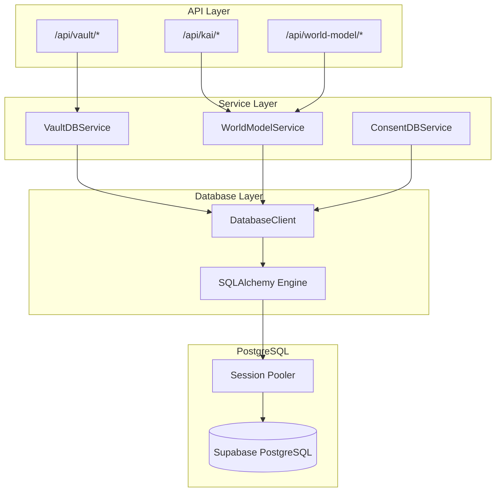
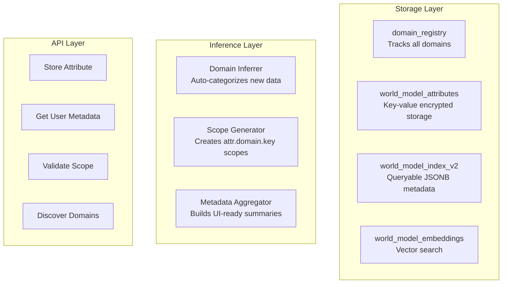
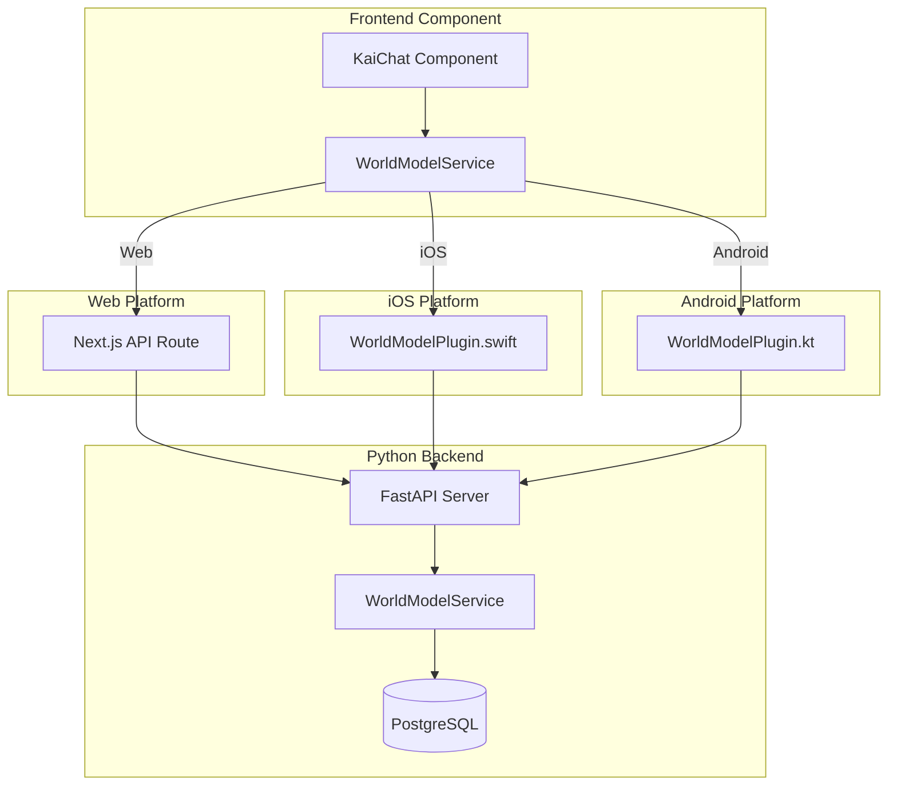

# Hushh Technical Architecture (v2.0.0)

> **Status**: Live (ADK Implementation)
> **Core Principle**: "Google ADK Brains, Hushh Security Soul."

## 1. High-Level Overview

Hushh v2.0 adopts a **Hub-and-Spoke** agent architecture built on the Google Agent Development Kit (ADK).
Instead of monolithic logic, we use specialized, smaller agents coordinated by a central Router.

### The "Unified Host" Model

- **Orchestrator (Hub)**: The single entry point for user intent. It does NOT do work; it delegates.
- **Specialist Agents (Spokes)**: Independent, stateless ADK Agents that perform specific domains (Food, Career, Finance).
- **Hushh Security Layer**: A wrapper around _every_ agent that enforces the Consent Protocol.

### ADK Runtime Status

> **Note**: The Google ADK integration uses conditional imports with fallback stubs. If ADK dependencies are unavailable at runtime, the system falls back to stub implementations that maintain API compatibility.

```python
# consent-protocol/hushh_mcp/hushh_adk/core.py
try:
    from google.adk import Agent
except ImportError:
    # Fallback stub for environments without ADK
    class Agent:
        def __init__(self, *args, **kwargs):
            pass
```

This means:
- **ADK Available**: Full agent orchestration with Gemini models
- **ADK Unavailable**: Graceful degradation with stub agents
- Check logs for `ADK import failed, using stubs` warning

### ADK Implementation Details

The Hushh system now fully implements Google ADK patterns with:
- **HushhAgent Base Class**: Extends ADK's LlmAgent with consent validation
- **@hushh_tool Decorator**: Enforces scope-based access control for all data operations
- **A2A Communication**: Full Agent-to-Agent protocol support with consent validation
- **Streaming Support**: Real-time debate processes and agent thinking streams

---

## 2. The Hushh ADK Standard

Every agent in the system must conform to the **Hushh ADK Standard**:

1.  **Manifest (`agent.yaml`)**:
    - Declarative definition of Model (`gemini-3-flash`), System Prompt, and Scopes.
    - Example: `required_scopes: [vault.read.finance]`

2.  **The Wrapper (`HushhAgent`)**:
    - Extends the standard ADK `Agent` class.
    - **Enforcement**: Automatically calls `validate_token()` before running any prompt.
    - **Context**: Injects `HushhContext` (User ID, Vault Keys) into the execution environment.

3.  **Secure Tools (`@hushh_tool`)**:
    - Python decorator that wraps ADK tools.
    - **Runtime Check**: verifies the active token has the specific scope for _that_ tool.
    - _No scope, no execution._

## 3. Data Flow: The "Hushh Way"

### Trace: "Analyze AAPL"

1.  **User Input**: `POST /api/orchestrator/chat` -> "Analyze AAPL".
2.  **Router**: `OrchestratorAgent` sees "Finance" intent -> Delegates to `KaiAgent`.
3.  **Execution**: `KaiAgent` (Coordinator) plans execution:
    - "I need fundamental data." -> Calls `perform_fundamental_analysis(ticker="AAPL")`.
4.  **Security Intercept**:
    - `@hushh_tool(scope="vault.read.finance")` triggers.
    - Checks `HushhContext.consent_token`.
    - **Pass**: Token has scope. Execution proceeds to Operon.
    - **Fail**: Raises `PermissionError`. Agent catches this and asks user for consent.
5.  **Operon**: Fetches data (e.g., from `sec_payload_aapl.json` or API).
6.  **Response**: Encrypted/Decrypted as needed, returned to User.

## 4. Agent Catalog

| Agent             | Role                | Model            | Key Tools                                                             |
| :---------------- | :------------------ | :--------------- | :-------------------------------------------------------------------- |
| **Orchestrator**  | **Router**          | `gemini-3-flash` | `delegate_to_kai`                                                     |
| **Kai (Finance)** | **Coordinator**     | `gemini-3-flash` | `perform_fundamental`, `perform_sentiment`, `perform_valuation`, `chat` |
| **Renaissance**   | **Research**        | N/A              | `get_renaissance_rating`, `enhance_analysis`, `identify_portfolio_alignment` |

> **Note**: Food & Dining and Professional agents have been deprecated. User data is now stored in the unified World Model with dynamic domains.

## 5. Directory Structure

```
hushh_mcp/
├── agents/             # The Spokes
│   ├── orchestrator/
│   └── kai/
│       └── renaissance_agent.py  # Research data integration
├── hushh_adk/          # The Foundation
│   ├── core.py         # HushhAgent
│   ├── tools.py        # @hushh_tool
│   └── context.py      # HushhContext
├── services/           # Service Layer
│   ├── world_model_service.py    # Unified user data model
│   ├── domain_registry_service.py # Dynamic domain management
│   ├── domain_inferrer.py        # Auto-categorization
│   ├── chat_db_service.py        # Persistent chat history
│   └── portfolio_parser.py       # Brokerage statement parsing
├── consent/            # Consent Protocol
│   └── scope_generator.py        # Dynamic scope generation
├── operons/            # The Business Logic (Pure Functions)
└── data/               # Static Datasets
    └── renaissance_universe.json # Research data
```

## 6. Database Service Layer Architecture

Hushh uses a **consent-first service layer** for all database operations. All database access goes through service classes that validate consent tokens before performing any operations.

### Service Layer Components

- **VaultDBService** (`hushh_mcp/services/vault_db.py`) - Vault operations (food, professional, kai)
- **ConsentDBService** (`hushh_mcp/services/consent_db.py`) - Consent management (pending requests, active tokens, audit log)
- **WorldModelService** (`hushh_mcp/services/world_model_service.py`) - Unified user data model
- **ChatDBService** (`hushh_mcp/services/chat_db_service.py`) - Persistent chat history
- **RenaissanceService** (`hushh_mcp/services/renaissance_service.py`) - Investable universe queries

### Architecture Flow



**Key Principle:** API routes MUST use service layer methods, never access database directly.

### Database Technology

- **SQLAlchemy + psycopg2** - Direct PostgreSQL connections via session pooler
- **Supabase Session Pooler** - Connection pooling managed by Supabase
- **PostgreSQL** - Database backend (managed by Supabase)
- **pgvector** - Vector embeddings for similarity search

### Connection Configuration

```env
DB_USER=postgres.your-project-ref
DB_PASSWORD=your-password
DB_HOST=aws-1-us-east-1.pooler.supabase.com
DB_PORT=5432
DB_NAME=postgres
```

See `docs/reference/database_service_layer.md` for detailed architecture.

## 7. World Model Architecture

The Hushh World Model is a **dynamic, schema-less** user data model that supports any domain without predefined structures.

### Three-Layer Architecture



### Key Features

- **Dynamic Domains**: No hardcoded enum - domains are auto-registered on first use
- **Auto-Categorization**: DomainInferrer uses keywords and patterns to categorize attributes
- **Dynamic Scopes**: Consent scopes follow `attr.{domain}.{attribute}` pattern
- **BYOK Encryption**: All sensitive attributes encrypted with user's vault key
- **UI Metadata**: Frontend receives display-ready domain cards with icons and colors

### Consent Scopes

Dynamic scopes are generated based on stored attributes:
- Specific: `attr.financial.holdings`
- Wildcard: `attr.financial.*`
- Domain-level: `attr.subscriptions`

## 8. Security & Compliance

- **Zero-Trust Tools**: Tools verify consent _again_, even if the Agent has it.

## 9. Full System Architecture Diagram

```mermaid
flowchart TB
    subgraph frontend [Frontend - hushh-webapp]
        Dashboard[Dashboard Page]
        Chat[Chat Page]
        Profile[Profile Page]
        Services[Service Layer]
    end
    
    subgraph native [Native Plugins]
        iOSKai[iOS KaiPlugin]
        AndroidKai[Android KaiPlugin]
        iOSWM[iOS WorldModelPlugin]
        AndroidWM[Android WorldModelPlugin]
    end
    
    subgraph backend [Backend - consent-protocol]
        KaiRoutes[Kai Routes]
        WorldModelRoutes[World Model Routes]
        A2AServer[A2A Server]
    end
    
    subgraph services [Service Layer]
        KaiChatService[KaiChatService]
        WorldModelService[WorldModelService]
        AttributeLearner[AttributeLearner]
        DomainInferrer[DomainInferrer]
    end
    
    subgraph adk [Hushh ADK]
        HushhAgent[HushhAgent]
        KaiAgent[KaiAgent]
        Tools[@hushh_tool]
    end
    
    subgraph database [Supabase PostgreSQL]
        WorldModelTables[world_model_*]
        ChatTables[chat_*]
        DomainTable[domain_registry]
        VaultTables[vault_*]
    end
    
    Dashboard --> Services
    Chat --> Services
    Profile --> Services
    Services --> iOSKai
    Services --> AndroidKai
    Services --> iOSWM
    Services --> AndroidWM
    iOSKai --> KaiRoutes
    AndroidKai --> KaiRoutes
    iOSWM --> WorldModelRoutes
    AndroidWM --> WorldModelRoutes
    KaiRoutes --> KaiChatService
    WorldModelRoutes --> WorldModelService
    KaiChatService --> HushhAgent
    HushhAgent --> KaiAgent
    KaiAgent --> Tools
    KaiChatService --> AttributeLearner
    AttributeLearner --> DomainInferrer
    WorldModelService --> WorldModelTables
    KaiChatService --> ChatTables
    DomainInferrer --> DomainTable
    A2AServer --> KaiAgent
```

## 10. Tri-Flow Architecture

The application supports Web, iOS, and Android platforms via Capacitor plugins:



### Platform Detection Pattern

```typescript
// Service layer detects platform and routes accordingly
if (Capacitor.isNativePlatform()) {
  // Use native plugin
  const { WorldModel } = await import('@/plugins/world-model');
  return WorldModel.getMetadata({ userId });
} else {
  // Use web API
  const response = await fetch(`/api/world-model/metadata/${userId}`);
  return response.json();
}
```
- **Manifest Truth**: Permissions are defined in `yaml`, not code.
- **Audit Logging**: Every tool invocation is logged with `ctx.user_id`.
- **Consent-Based Access**: All data access requires valid consent token with appropriate scope.