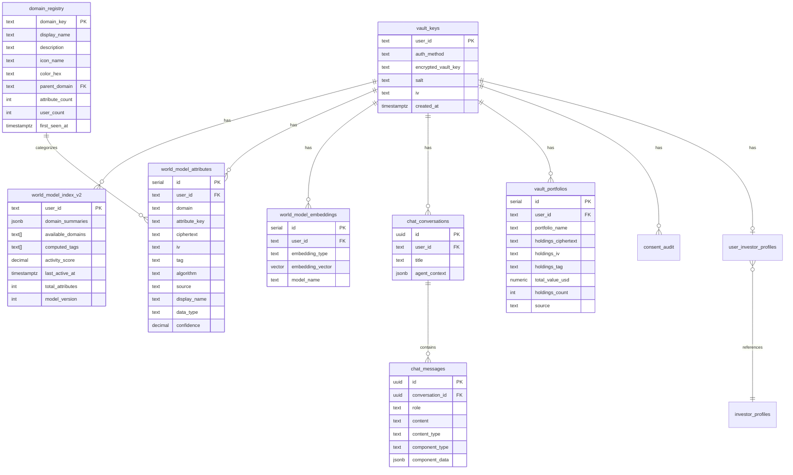

# Database Schema

> PostgreSQL schema for the Hushh encrypted vault, investor profiles, world model, and consent audit system.

---

## 🔌 Database Connection

Hushh uses **SQLAlchemy with Supabase's Session Pooler** for direct PostgreSQL connections.

### Connection Configuration

```env
# .env file
DB_USER=postgres.your-project-ref
DB_PASSWORD=your-password
DB_HOST=aws-1-us-east-1.pooler.supabase.com
DB_PORT=5432
DB_NAME=postgres
```

### Running Migrations

```bash
cd consent-protocol
python -c "
from db.db_client import get_db_connection
from sqlalchemy import text

with get_db_connection() as conn:
    with open('db/migrations/007_renaissance_universe.sql', 'r') as f:
        conn.execute(text(f.read()))
    conn.commit()
    print('Migration complete!')
"
```

---

## 🎯 Design Principles

| Principle             | Implementation                                     |
| --------------------- | -------------------------------------------------- |
| **Zero-Knowledge**    | All user data stored as AES-256-GCM ciphertext     |
| **Dynamic Domains**   | World model supports any domain without schema changes |
| **Field-Based Storage** | Each encrypted field stored as separate row      |
| **Audit Trail**       | `consent_audit` logs all token operations          |
| **No Plaintext**      | Server cannot decrypt any user data                |
| **Investor Layer**    | Public profiles for discovery, encrypted for vault |
| **Vector Search**     | pgvector embeddings for similarity matching        |

---

## 📊 Entity Relationship Diagram



---

## 📋 Table Definitions

### vault_keys

Stores encrypted vault keys for zero-knowledge recovery. This is the root table - all other vault tables reference it.

```sql
CREATE TABLE vault_keys (
    user_id TEXT PRIMARY KEY,
    auth_method TEXT NOT NULL DEFAULT 'passphrase',
    
    -- Passphrase-encrypted vault key
    encrypted_vault_key TEXT NOT NULL,
    salt TEXT NOT NULL,
    iv TEXT NOT NULL,
    
    -- Recovery-encrypted vault key
    recovery_encrypted_vault_key TEXT NOT NULL,
    recovery_salt TEXT NOT NULL,
    recovery_iv TEXT NOT NULL,
    
    created_at BIGINT NOT NULL,
    updated_at BIGINT
);
```

**Notes:**
- `user_id` is Firebase UID (e.g., `UWHGeUyfUAbmEl5xwIPoWJ7Cyft2`)
- `auth_method` is currently always `'passphrase'` (biometric planned)
- Both passphrase and recovery keys can decrypt the vault key

---

### domain_registry

Dynamic domain registry for the World Model. Domains are auto-registered when new attribute types are discovered.

```sql
CREATE TABLE domain_registry (
    domain_key TEXT PRIMARY KEY,
    display_name TEXT NOT NULL,
    description TEXT,
    icon_name TEXT,                  -- Lucide icon name
    color_hex TEXT,                  -- Brand color for UI
    parent_domain TEXT REFERENCES domain_registry(domain_key),
    attribute_count INTEGER DEFAULT 0,
    user_count INTEGER DEFAULT 0,
    first_seen_at TIMESTAMPTZ DEFAULT NOW(),
    last_updated_at TIMESTAMPTZ DEFAULT NOW()
);

CREATE INDEX idx_domain_parent ON domain_registry(parent_domain);
```

**Seeded Domains:**
| domain_key | display_name | icon_name | color_hex |
|------------|--------------|-----------|-----------|
| financial | Financial | wallet | #D4AF37 |
| food | Food & Dining | utensils | #F97316 |
| professional | Professional | briefcase | #8B5CF6 |
| health | Health & Wellness | heart | #EF4444 |
| travel | Travel | plane | #0EA5E9 |
| entertainment | Entertainment | tv | #EC4899 |
| shopping | Shopping | shopping-bag | #14B8A6 |
| subscriptions | Subscriptions | credit-card | #6366F1 |
| general | General | folder | #6B7280 |
| kai_decisions | Kai Decisions | brain | #D4AF37 |
| kai_preferences | Kai Preferences | settings | #D4AF37 |

---

### world_model_attributes

**Primary encrypted storage** for all user data using BYOK (Bring Your Own Key) encryption. Replaces legacy domain-specific tables (`vault_food`, `vault_professional`, etc.).

```sql
CREATE TABLE world_model_attributes (
    id SERIAL PRIMARY KEY,
    user_id TEXT NOT NULL REFERENCES vault_keys(user_id) ON DELETE CASCADE,
    domain TEXT NOT NULL,            -- References domain_registry.domain_key
    attribute_key TEXT NOT NULL,     -- e.g., 'dietary_restrictions', 'risk_tolerance'
    
    -- Encrypted Value (BYOK)
    ciphertext TEXT NOT NULL,
    iv TEXT NOT NULL,
    tag TEXT NOT NULL,
    algorithm TEXT DEFAULT 'aes-256-gcm',
    
    -- Metadata
    source TEXT NOT NULL DEFAULT 'explicit',  -- 'explicit', 'inferred', 'imported', 'computed'
    confidence DECIMAL(3,2),
    inferred_at TIMESTAMPTZ,
    display_name TEXT,
    data_type TEXT DEFAULT 'string',
    
    created_at TIMESTAMPTZ DEFAULT NOW(),
    updated_at TIMESTAMPTZ DEFAULT NOW(),
    
    UNIQUE(user_id, domain, attribute_key)
);

CREATE INDEX idx_wma_user ON world_model_attributes(user_id);
CREATE INDEX idx_wma_domain ON world_model_attributes(domain);
```

**Example Data:**
| user_id | domain | attribute_key | source | data_type |
|---------|--------|---------------|--------|-----------|
| UWHGe... | financial | holdings_count | imported | number |
| UWHGe... | financial | risk_bucket | computed | string |
| UWHGe... | kai_decisions | AAPL_decision | computed | string |
| UWHGe... | food | dietary_restrictions | explicit | array |

---

### world_model_index_v2

Queryable index layer for user world models. Updated automatically via triggers when attributes change.

```sql
CREATE TABLE world_model_index_v2 (
    user_id TEXT PRIMARY KEY REFERENCES vault_keys(user_id) ON DELETE CASCADE,
    domain_summaries JSONB DEFAULT '{}',
    available_domains TEXT[] DEFAULT '{}',
    computed_tags TEXT[] DEFAULT '{}',
    activity_score DECIMAL(3,2),
    last_active_at TIMESTAMPTZ,
    total_attributes INTEGER DEFAULT 0,
    model_version INTEGER DEFAULT 2,
    created_at TIMESTAMPTZ DEFAULT NOW(),
    updated_at TIMESTAMPTZ DEFAULT NOW()
);

CREATE INDEX idx_wmi2_domains ON world_model_index_v2 USING GIN(domain_summaries);
CREATE INDEX idx_wmi2_available ON world_model_index_v2 USING GIN(available_domains);
CREATE INDEX idx_wmi2_tags ON world_model_index_v2 USING GIN(computed_tags);
```

---

### world_model_embeddings

Vector embeddings for similarity search using pgvector.

```sql
CREATE TABLE world_model_embeddings (
    id SERIAL PRIMARY KEY,
    user_id TEXT NOT NULL REFERENCES vault_keys(user_id) ON DELETE CASCADE,
    embedding_type embedding_type NOT NULL,  -- 'financial_profile', 'lifestyle_profile', etc.
    embedding_vector vector(384),            -- all-MiniLM-L6-v2 dimension
    model_name TEXT DEFAULT 'all-MiniLM-L6-v2',
    created_at TIMESTAMPTZ DEFAULT NOW(),
    updated_at TIMESTAMPTZ DEFAULT NOW(),
    UNIQUE(user_id, embedding_type)
);

-- HNSW Index for fast similarity search
CREATE INDEX idx_wme_vector ON world_model_embeddings 
USING hnsw (embedding_vector vector_cosine_ops);
```

---

### chat_conversations

Persistent chat history for Kai conversations.

```sql
CREATE TABLE chat_conversations (
    id UUID PRIMARY KEY DEFAULT gen_random_uuid(),
    user_id TEXT NOT NULL REFERENCES vault_keys(user_id) ON DELETE CASCADE,
    title TEXT,
    agent_context JSONB,             -- Current session state
    created_at TIMESTAMPTZ DEFAULT NOW(),
    updated_at TIMESTAMPTZ DEFAULT NOW()
);

CREATE INDEX idx_chat_conv_user ON chat_conversations(user_id);
```

---

### chat_messages

Individual messages within conversations, supporting insertable components.

```sql
CREATE TABLE chat_messages (
    id UUID PRIMARY KEY DEFAULT gen_random_uuid(),
    conversation_id UUID NOT NULL REFERENCES chat_conversations(id) ON DELETE CASCADE,
    role TEXT NOT NULL CHECK (role IN ('user', 'assistant', 'system', 'tool')),
    content TEXT NOT NULL,
    content_type TEXT DEFAULT 'text',  -- 'text', 'component', 'tool_use'
    
    -- For insertable components
    component_type TEXT,               -- 'analysis', 'portfolio_import', 'loser_report', etc.
    component_data JSONB,
    
    -- Metadata
    tokens_used INTEGER,
    model_used TEXT,
    created_at TIMESTAMPTZ DEFAULT NOW()
);

CREATE INDEX idx_chat_msg_conv ON chat_messages(conversation_id);
CREATE INDEX idx_chat_msg_created ON chat_messages(created_at DESC);
```

---

### vault_portfolios

Encrypted portfolio holdings imported from brokerage statements.

```sql
CREATE TABLE vault_portfolios (
    id SERIAL PRIMARY KEY,
    user_id TEXT NOT NULL REFERENCES vault_keys(user_id) ON DELETE CASCADE,
    portfolio_name TEXT DEFAULT 'Main Portfolio',
    
    -- Encrypted holdings array
    holdings_ciphertext TEXT NOT NULL,
    holdings_iv TEXT NOT NULL,
    holdings_tag TEXT NOT NULL,
    algorithm TEXT DEFAULT 'aes-256-gcm',
    
    -- Metadata (unencrypted for display)
    total_value_usd NUMERIC,
    holdings_count INTEGER,
    source TEXT,                     -- 'manual', 'csv', 'pdf_schwab', 'plaid'
    
    last_imported_at TIMESTAMPTZ,
    created_at TIMESTAMPTZ DEFAULT NOW(),
    updated_at TIMESTAMPTZ DEFAULT NOW(),
    
    UNIQUE(user_id, portfolio_name)
);

CREATE INDEX idx_portfolio_user ON vault_portfolios(user_id);
```

---

### investor_profiles (PUBLIC)

**Public discovery layer** - stores publicly available investor information from SEC filings.
**NOT encrypted** - server can read this (it's all public data).

Used during Kai onboarding to show: "Is this you?"

```sql
CREATE TABLE investor_profiles (
    id SERIAL PRIMARY KEY,
    
    -- Identity (for name-based matching)
    name TEXT NOT NULL,
    name_normalized TEXT,            -- Lowercase, no spaces (for fuzzy search)
    cik TEXT UNIQUE,                 -- SEC CIK number
    
    -- Profile
    firm TEXT,
    title TEXT,
    investor_type TEXT,              -- 'institutional', 'insider', etc.
    photo_url TEXT,
    
    -- Holdings Summary (from 13F/Form4)
    aum_billions NUMERIC,
    top_holdings JSONB,              -- [{ticker, weight}, ...]
    sector_exposure JSONB,           -- {Technology: 40, Healthcare: 20, ...}
    
    -- Inferred Profile
    investment_style TEXT[],         -- ['Value', 'Growth', ...]
    risk_tolerance TEXT,
    time_horizon TEXT,
    portfolio_turnover TEXT,
    
    -- Activity Signals
    recent_buys TEXT[],
    recent_sells TEXT[],
    
    -- Enrichment
    public_quotes JSONB,
    biography TEXT,
    education TEXT[],
    board_memberships TEXT[],
    peer_investors TEXT[],
    
    -- Insider-specific (Form 4)
    is_insider BOOLEAN DEFAULT FALSE,
    insider_company_ticker TEXT,
    
    -- Data Source Tracking
    data_sources TEXT[],
    last_13f_date DATE,
    last_form4_date DATE,
    
    created_at TIMESTAMPTZ DEFAULT NOW(),
    updated_at TIMESTAMPTZ DEFAULT NOW()
);

-- Indexes for efficient searching
CREATE INDEX idx_investor_name ON investor_profiles(name);
CREATE INDEX idx_investor_name_trgm ON investor_profiles USING GIN (name gin_trgm_ops);
CREATE INDEX idx_investor_firm ON investor_profiles(firm);
CREATE INDEX idx_investor_cik ON investor_profiles(cik) WHERE cik IS NOT NULL;
CREATE INDEX idx_investor_type ON investor_profiles(investor_type);
CREATE INDEX idx_investor_style ON investor_profiles USING GIN (investment_style);
```

**Example `top_holdings` JSONB:**
```json
[
  {"ticker": "NVDA", "weight": 20.0},
  {"ticker": "MSFT", "weight": 15.0},
  {"ticker": "GOOGL", "weight": 10.0}
]
```

---

### user_investor_profiles (PRIVATE)

**Private vault layer** - stores user-confirmed investor profile data.
**E2E encrypted** - server CANNOT read this.

Created when user confirms: "Yes, this is me"

```sql
CREATE TABLE user_investor_profiles (
    id SERIAL PRIMARY KEY,
    user_id TEXT NOT NULL REFERENCES vault_keys(user_id) ON DELETE CASCADE,
    
    -- Link to public profile (optional, for reference only)
    confirmed_investor_id INTEGER REFERENCES investor_profiles(id),
    
    -- Encrypted profile data (E2E encrypted copy from public)
    profile_data_ciphertext TEXT,
    profile_data_iv TEXT,
    profile_data_tag TEXT,
    
    -- Encrypted holdings (user's actual holdings, not public)
    custom_holdings_ciphertext TEXT,
    custom_holdings_iv TEXT,
    custom_holdings_tag TEXT,
    
    -- Encrypted preferences (user's adjusted preferences)
    preferences_ciphertext TEXT,
    preferences_iv TEXT,
    preferences_tag TEXT,
    
    -- Consent tracking
    confirmed_at TIMESTAMPTZ,
    consent_scope TEXT,
    
    algorithm TEXT DEFAULT 'aes-256-gcm',
    created_at TIMESTAMPTZ DEFAULT NOW(),
    updated_at TIMESTAMPTZ DEFAULT NOW(),
    
    UNIQUE(user_id)                  -- One profile per user
);

CREATE INDEX idx_user_investor_user ON user_investor_profiles(user_id);
```

**Data Flow:**
```
investor_profiles (PUBLIC)     user_investor_profiles (PRIVATE)
┌─────────────────────────┐    ┌─────────────────────────────────┐
│ id: 21                  │◄───│ confirmed_investor_id: 21       │
│ name: "Kushal Mehta"    │    │ user_id: "UWHGeUyf..."          │
│ top_holdings: [...]     │    │ profile_data_ciphertext: "..."  │
│ ...all public fields... │    │ (encrypted copy of public data) │
└─────────────────────────┘    └─────────────────────────────────┘
```

---

### consent_audit

Immutable audit log of all consent token operations.

```sql
CREATE TABLE consent_audit (
    id SERIAL PRIMARY KEY,
    token_id TEXT NOT NULL,
    user_id TEXT NOT NULL,
    agent_id TEXT NOT NULL,          -- 'self' for VAULT_OWNER, agent name otherwise
    scope TEXT NOT NULL,             -- 'vault.owner', 'agent.kai.analyze', etc.
    action TEXT NOT NULL,            -- 'ISSUED', 'VALIDATED', 'REVOKED', 'REQUESTED'
    issued_at BIGINT NOT NULL,
    expires_at BIGINT,
    revoked_at BIGINT,
    metadata JSONB,
    token_type VARCHAR(20) DEFAULT 'consent',
    ip_address VARCHAR(45),
    user_agent TEXT,
    request_id VARCHAR(32),          -- For consent request tracking
    scope_description TEXT,
    poll_timeout_at BIGINT           -- For pending consent requests
);

CREATE INDEX idx_consent_user ON consent_audit(user_id);
CREATE INDEX idx_consent_token ON consent_audit(token_id);
CREATE INDEX idx_consent_audit_created ON consent_audit(issued_at DESC);
CREATE INDEX idx_consent_audit_user_action ON consent_audit(user_id, action);
CREATE INDEX idx_consent_audit_request_id ON consent_audit(request_id) WHERE request_id IS NOT NULL;
CREATE INDEX idx_consent_audit_pending ON consent_audit(user_id) WHERE action = 'REQUESTED';
```

---

## 🔐 Encrypted Data Format

Each encrypted field follows this structure:

```json
{
  "ciphertext": "base64-encoded-ciphertext",
  "iv": "base64-encoded-12-byte-iv",
  "tag": "base64-encoded-16-byte-auth-tag"
}
```

**Encryption Details:**
- Algorithm: AES-256-GCM
- Key: 256-bit derived from passphrase via PBKDF2 (100k iterations)
- IV: 12 bytes, randomly generated per encryption
- Tag: 16 bytes, authentication tag

---

## 📈 Key Queries

### Get User World Model Metadata (RPC Function)

Returns comprehensive metadata about a user's world model:

```sql
CREATE OR REPLACE FUNCTION get_user_world_model_metadata(p_user_id TEXT)
RETURNS JSONB
LANGUAGE plpgsql STABLE
AS $$
DECLARE
    v_result JSONB;
BEGIN
    SELECT jsonb_build_object(
        'user_id', p_user_id,
        'domains', COALESCE((
            SELECT jsonb_agg(
                jsonb_build_object(
                    'key', dr.domain_key,
                    'display_name', dr.display_name,
                    'icon', dr.icon_name,
                    'color', dr.color_hex,
                    'attribute_count', (
                        SELECT COUNT(*) 
                        FROM world_model_attributes wma 
                        WHERE wma.user_id = p_user_id AND wma.domain = dr.domain_key
                    )
                )
            )
            FROM domain_registry dr
            WHERE dr.domain_key = ANY(
                SELECT DISTINCT domain FROM world_model_attributes WHERE user_id = p_user_id
            )
        ), '[]'::jsonb),
        'total_attributes', COALESCE((
            SELECT COUNT(*) FROM world_model_attributes WHERE user_id = p_user_id
        ), 0),
        'available_domains', COALESCE((
            SELECT array_agg(DISTINCT domain) FROM world_model_attributes WHERE user_id = p_user_id
        ), ARRAY[]::TEXT[])
    ) INTO v_result;
    
    RETURN v_result;
END;
$$;
```

**Usage:**
```sql
SELECT get_user_world_model_metadata('UWHGeUyfUAbmEl5xwIPoWJ7Cyft2');
```

---

### Auto-Register Domain (RPC Function)

Automatically registers new domains when discovered:

```sql
CREATE OR REPLACE FUNCTION auto_register_domain(
    p_domain_key TEXT,
    p_display_name TEXT DEFAULT NULL,
    p_icon_name TEXT DEFAULT 'folder',
    p_color_hex TEXT DEFAULT '#6B7280'
)
RETURNS JSONB
LANGUAGE plpgsql
AS $$
DECLARE
    v_display_name TEXT;
    v_result JSONB;
BEGIN
    v_display_name := COALESCE(p_display_name, INITCAP(REPLACE(p_domain_key, '_', ' ')));
    
    INSERT INTO domain_registry (domain_key, display_name, icon_name, color_hex)
    VALUES (p_domain_key, v_display_name, p_icon_name, p_color_hex)
    ON CONFLICT (domain_key) DO NOTHING;
    
    SELECT jsonb_build_object(
        'domain_key', domain_key,
        'display_name', display_name,
        'icon_name', icon_name,
        'color_hex', color_hex
    ) INTO v_result
    FROM domain_registry
    WHERE domain_key = p_domain_key;
    
    RETURN v_result;
END;
$$;
```

---

### Similarity Search (RPC Function)

Find similar user profiles using vector embeddings:

```sql
CREATE OR REPLACE FUNCTION match_user_profiles(
    query_embedding vector(384),
    embedding_type_filter embedding_type,
    match_threshold float DEFAULT 0.7,
    match_count int DEFAULT 10
)
RETURNS TABLE (
    user_id text,
    similarity float
)
LANGUAGE sql STABLE
AS $$
    SELECT
        user_id,
        1 - (embedding_vector <=> query_embedding) as similarity
    FROM world_model_embeddings
    WHERE embedding_type = embedding_type_filter
      AND 1 - (embedding_vector <=> query_embedding) > match_threshold
    ORDER BY embedding_vector <=> query_embedding
    LIMIT match_count;
$$;
```

---

### Get World Model Status

Used by dashboard to show domain counts:

```sql
SELECT 
    wmi.total_attributes,
    wmi.available_domains,
    wmi.last_active_at,
    (SELECT COUNT(*) FROM vault_portfolios WHERE user_id = $1) as portfolio_count
FROM world_model_index_v2 wmi
WHERE wmi.user_id = $1;
```

### Get Investor Stock Count

To display stock count on dashboard, the **client** must decrypt `profile_data_ciphertext`:

```typescript
// Dashboard fetches encrypted profile
const encrypted = await HushhIdentity.getEncryptedProfile({ vaultOwnerToken });

// Client decrypts with vault key
const plaintext = await HushhVault.decryptData({
  keyHex: vaultKey,
  payload: encrypted.profile_data,
});

// Parse and count holdings
const profile = JSON.parse(plaintext);
const stockCount = profile.top_holdings?.length || 0;
```

### Audit Trail for User

```sql
SELECT
    agent_id,
    scope,
    action,
    to_timestamp(issued_at) as issued_at
FROM consent_audit
WHERE user_id = $1
ORDER BY issued_at DESC
LIMIT 50;
```

---

## 🛡️ Security Notes

| Concern           | Mitigation                                    |
| ----------------- | --------------------------------------------- |
| SQL Injection     | Parameterized queries only (asyncpg)          |
| Data at Rest      | All vault_* fields encrypted with AES-256-GCM |
| Key Storage       | Vault keys encrypted with derived keys        |
| Audit Integrity   | Append-only design, no UPDATE/DELETE on audit |
| Token Exposure    | Token ID stored, not full token               |
| Public vs Private | `investor_profiles` public, `user_investor_profiles` encrypted |

---

## 🔄 Migrations

### Migration Files

| File | Description |
|------|-------------|
| `COMBINED_MIGRATION.sql` | Creates all world model tables, chat tables, and portfolio tables |
| `005_encrypt_chat_tables.sql` | Adds encryption columns to chat tables |

### Run Migration

Execute in Supabase SQL Editor:

```sql
-- Run COMBINED_MIGRATION.sql first
-- Then run 005_encrypt_chat_tables.sql
```

### Table Creation Order (Dependencies)

1. `vault_keys` (root)
2. `domain_registry` (standalone)
3. `world_model_attributes` (depends on vault_keys)
4. `world_model_index_v2` (depends on vault_keys)
5. `world_model_embeddings` (depends on vault_keys)
6. `chat_conversations` (depends on vault_keys)
7. `chat_messages` (depends on chat_conversations)
8. `vault_portfolios` (depends on vault_keys)
9. `consent_audit` (references vault_keys)
10. `investor_profiles` (standalone public table)
11. `user_investor_profiles` (depends on vault_keys, references investor_profiles)

---

## 📊 Domain Summary

| Domain | Table | Storage Pattern | Privacy |
|--------|-------|-----------------|---------|
| **All User Data** | `world_model_attributes` | Field-based (N rows per user per domain) | E2E Encrypted |
| **User Index** | `world_model_index_v2` | Single row per user | Non-sensitive metadata |
| **Domain Registry** | `domain_registry` | One row per domain | Public |
| **Embeddings** | `world_model_embeddings` | One row per user per type | Computed vectors |
| **Chat History** | `chat_conversations` + `chat_messages` | Conversation-based | E2E Encrypted |
| **Portfolios** | `vault_portfolios` | Single row per portfolio | E2E Encrypted |
| **Investor (Public)** | `investor_profiles` | Single row per investor | **Public** (SEC data) |
| **Investor (Private)** | `user_investor_profiles` | Single row per user | E2E Encrypted |
| **Consent Audit** | `consent_audit` | Append-only log | Token IDs only |

---

## 🔄 Triggers

### Auto-Update Domain Counts

When attributes are inserted/deleted, domain registry counts are automatically updated:

```sql
CREATE OR REPLACE FUNCTION update_domain_registry_counts()
RETURNS TRIGGER AS $$
BEGIN
    IF TG_OP = 'INSERT' THEN
        UPDATE domain_registry 
        SET attribute_count = attribute_count + 1,
            last_updated_at = NOW()
        WHERE domain_key = NEW.domain;
    ELSIF TG_OP = 'DELETE' THEN
        UPDATE domain_registry 
        SET attribute_count = GREATEST(0, attribute_count - 1),
            last_updated_at = NOW()
        WHERE domain_key = OLD.domain;
    END IF;
    RETURN NULL;
END;
$$ LANGUAGE plpgsql;

CREATE TRIGGER trg_update_domain_counts
    AFTER INSERT OR DELETE ON world_model_attributes
    FOR EACH ROW EXECUTE FUNCTION update_domain_registry_counts();
```

### Auto-Update User Index

When attributes change, the user's index is automatically updated:

```sql
CREATE OR REPLACE FUNCTION update_user_index_on_attribute_change()
RETURNS TRIGGER AS $$
BEGIN
    INSERT INTO world_model_index_v2 (user_id, available_domains, total_attributes, last_active_at)
    SELECT 
        COALESCE(NEW.user_id, OLD.user_id),
        ARRAY(SELECT DISTINCT domain FROM world_model_attributes WHERE user_id = COALESCE(NEW.user_id, OLD.user_id)),
        (SELECT COUNT(*) FROM world_model_attributes WHERE user_id = COALESCE(NEW.user_id, OLD.user_id)),
        NOW()
    ON CONFLICT (user_id) DO UPDATE SET
        available_domains = EXCLUDED.available_domains,
        total_attributes = EXCLUDED.total_attributes,
        last_active_at = NOW(),
        updated_at = NOW();
    RETURN NULL;
END;
$$ LANGUAGE plpgsql;

CREATE TRIGGER trg_update_user_index
    AFTER INSERT OR UPDATE OR DELETE ON world_model_attributes
    FOR EACH ROW EXECUTE FUNCTION update_user_index_on_attribute_change();
```

---

## 📈 Renaissance Universe

The `renaissance_universe` table stores the Renaissance AI Fund's investable stock universe with tier classifications.

### renaissance_universe

```sql
CREATE TABLE renaissance_universe (
    id SERIAL PRIMARY KEY,
    ticker TEXT NOT NULL UNIQUE,
    company_name TEXT NOT NULL,
    sector TEXT NOT NULL,
    tier TEXT NOT NULL CHECK (tier IN ('ACE', 'KING', 'QUEEN', 'JACK')),
    fcf_billions NUMERIC(10,2),           -- 2024 Free Cash Flow in billions
    investment_thesis TEXT,                -- Why investable
    tier_rank INTEGER,                     -- Rank within tier (1 = best)
    created_at TIMESTAMPTZ DEFAULT NOW(),
    updated_at TIMESTAMPTZ DEFAULT NOW()
);
```

### Tier Definitions

| Tier | Description | Count | FCF Range |
|------|-------------|-------|-----------|
| **ACE** | Top-tier, largest FCF generators with strongest moats | 30 | $6B - $109B |
| **KING** | High-quality companies with strong market positions | 41 | $1.5B - $22B |
| **QUEEN** | Quality companies with solid fundamentals | 36 | $0.8B - $11B |
| **JACK** | Good companies, smaller FCF but still investable | 44 | $0.3B - $6.5B |

### RPC Functions

**Check if ticker is investable:**
```sql
SELECT is_renaissance_investable('AAPL');
-- Returns: {"is_investable": true, "ticker": "AAPL", "tier": "ACE", ...}
```

**Get stocks by tier:**
```sql
SELECT get_renaissance_by_tier('ACE');
-- Returns: JSON array of all ACE tier stocks
```

---

_Version: 3.0 | Updated: January 31, 2026 | World Model Architecture_
