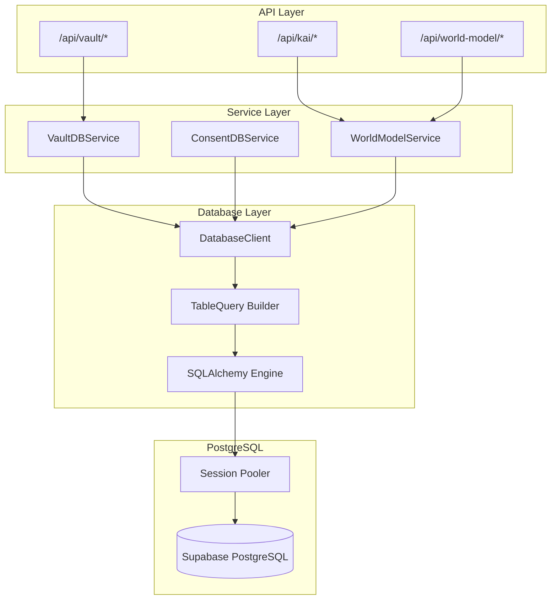

# Database Service Layer Architecture

> **Status**: Active (SQLAlchemy Session Pooler)
> **Last Updated**: January 2026

## Overview

Hushh uses a **consent-first service layer architecture** for all database operations. All database access goes through service classes that validate consent tokens before performing any operations.

The database layer uses **SQLAlchemy with Supabase's Session Pooler** for direct PostgreSQL connections, providing better performance and full SQL capabilities.

## Core Principle: Consent-First & Agent-Mediated Access

**MANDATORY:** All database access MUST go through service layer with consent validation.

### Architecture Flow

```
API Route → Service Layer (validates consent) → DB Client → PostgreSQL
```



### Forbidden Pattern (DO NOT DO)

```python
# ❌ WRONG: API route directly accessing database
@router.post("/preferences")
async def get_preferences():
    db = get_db()  # ❌ Direct access
    response = db.table("world_model_data").select("*").execute()
```

### Required Pattern

```python
# ✅ CORRECT: API route → Service layer → Database
@router.post("/preferences")
async def get_preferences():
    # Service validates consent token internally
    service = VaultDBService()
    data = await service.get_encrypted_fields(
        user_id=user_id,
        domain="food",
        consent_token=consent_token  # Validated inside service
    )
```

## Database Client (`db/db_client.py`)

The database client provides a Supabase-compatible API using SQLAlchemy for direct PostgreSQL access.

### Connection Configuration

```python
# Environment variables required in .env
DB_USER=postgres.your-project-ref
DB_PASSWORD=your-password
DB_HOST=aws-1-us-east-1.pooler.supabase.com
DB_PORT=5432
DB_NAME=postgres
```

### Usage

```python
from db.db_client import get_db

db = get_db()

# Select
result = db.table("users").select("*").eq("id", user_id).execute()

# Insert
result = db.table("users").insert({"name": "John", "email": "john@example.com"}).execute()

# Update
result = db.table("users").update({"name": "Jane"}).eq("id", user_id).execute()

# Delete
result = db.table("users").delete().eq("id", user_id).execute()

# Upsert
result = db.table("users").upsert({"id": user_id, "name": "John"}, on_conflict="id").execute()

# Raw SQL
result = db.execute_raw("SELECT * FROM users WHERE id = :id", {"id": user_id})

# RPC (PostgreSQL functions)
result = db.rpc("is_renaissance_investable", {"p_ticker": "AAPL"})
```

### Query Builder Methods

| Method | Description |
|--------|-------------|
| `select(columns)` | Select columns (default "*") |
| `insert(data)` | Insert single row or list of rows |
| `update(data)` | Update rows matching filters |
| `upsert(data, on_conflict)` | Insert or update on conflict |
| `delete()` | Delete rows matching filters |
| `eq(col, val)` | Filter where column equals value |
| `neq(col, val)` | Filter where column not equals value |
| `gt(col, val)` | Filter where column greater than value |
| `gte(col, val)` | Filter where column >= value |
| `lt(col, val)` | Filter where column less than value |
| `lte(col, val)` | Filter where column <= value |
| `like(col, pattern)` | Filter with LIKE pattern |
| `ilike(col, pattern)` | Filter with case-insensitive LIKE |
| `is_(col, val)` | Filter where column IS value (NULL checks) |
| `in_(col, values)` | Filter where column IN list |
| `order(col, desc)` | Order results |
| `limit(n)` | Limit results |
| `offset(n)` | Offset results |
| `single()` | Expect single result |
| `execute()` | Execute query and return results |

## Service Layer Components

### 1. VaultDBService (`hushh_mcp/services/vault_db.py`)

Unified database service for agent-mediated vault access.

**Responsibilities:**

- Validate consent tokens before all operations
- Store and retrieve encrypted vault data
- Handle vault operations for all domains
- Log audit events

**Key Methods:**

- `get_encrypted_fields()` - Retrieve encrypted fields (requires read consent)
- `store_encrypted_field()` - Store single encrypted field (requires write consent)
- `store_encrypted_fields()` - Batch store encrypted fields (requires write consent)
- `delete_encrypted_fields()` - Delete encrypted fields (requires write consent)

### 2. WorldModelService (`hushh_mcp/services/world_model_service.py`)

Service for the unified world model with dynamic domains.

**Responsibilities:**

- Manage world model index and attributes
- Handle dynamic domain registration
- Store encrypted attributes with BYOK encryption
- Manage user profile embeddings

**Key Methods:**

- `get_user_metadata()` - Get UI-ready world model metadata
- `store_attribute()` - Store encrypted attribute
- `get_attributes()` - Get attributes by domain
- `update_index()` - Update world model index

### 3. ConsentDBService (`hushh_mcp/services/consent_db.py`)

Service layer for consent-related database operations.

**Key Methods:**

- `get_pending_requests()` - Get pending consent requests
- `get_active_tokens()` - Get active consent tokens
- `insert_event()` - Insert consent event

### 4. ChatDBService (`hushh_mcp/services/chat_db_service.py`)

Service for persistent chat history with insertable components.

**Key Methods:**

- `create_conversation()` - Create new conversation
- `add_message()` - Add message to conversation
- `get_messages()` - Get conversation messages
- `get_conversations()` - List user's conversations

### 5. RenaissanceService (`hushh_mcp/services/renaissance_service.py`)

Service for querying the Renaissance investable universe.

**Key Methods:**

- `is_investable()` - Check if ticker is in universe
- `get_tier_weight()` - Get conviction weight for ticker
- `get_analysis_context()` - Get full context for analysis

## Access Rules

**Who can access the database client:**

- ✅ Service classes (`VaultDBService`, `ConsentDBService`, `WorldModelService`, etc.)
- ❌ API routes (forbidden - use service layer instead)
- ❌ Direct imports in route files (forbidden)

## API Route Pattern

All API routes should follow this pattern:

```python
from hushh_mcp.services.vault_db import VaultDBService, ConsentValidationError
from fastapi import HTTPException

@router.post("/preferences")
async def get_preferences(request: Request):
    body = await request.json()
    user_id = body.get("userId")
    consent_token = body.get("consentToken")

    # Use service layer (validates consent internally)
    service = VaultDBService()
    try:
        data = await service.get_encrypted_fields(
            user_id=user_id,
            domain="food",
            consent_token=consent_token
        )
    except ConsentValidationError as e:
        raise HTTPException(
            status_code=401 if e.reason in ["missing_token", "invalid_token"] else 403,
            detail=str(e)
        )

    return {"preferences": data}
```

## Running Migrations

Migrations use the same database client:

```python
from db.db_client import get_db_connection

with get_db_connection() as conn:
    with open("db/migrations/007_renaissance_universe.sql", "r") as f:
        conn.execute(text(f.read()))
    conn.commit()
```

Or via command line:

```bash
cd consent-protocol
python -c "
from db.db_client import get_db_connection
from sqlalchemy import text

with get_db_connection() as conn:
    with open('db/migrations/007_renaissance_universe.sql', 'r') as f:
        conn.execute(text(f.read()))
    conn.commit()
    print('Migration complete!')
"
```

## Security Audit Commands

```bash
# Verify no direct database access in API routes
grep -rE "from db\.(db_client|supabase_client) import|get_db\(\)|get_supabase\(\)" consent-protocol/api/routes/

# Should return ZERO results

# Verify service layer files have database access
grep -r "from db.db_client import" consent-protocol/hushh_mcp/services/

# Should return results (service layer should have access)
```

## Benefits of Session Pooler

1. **Direct PostgreSQL Access** - Lower latency than REST API
2. **Full SQL Power** - Transactions, CTEs, raw queries
3. **Single Connection Method** - Same pattern for migrations and CRUD
4. **Supabase-Compatible API** - Easy migration from REST API
5. **Connection Pooling** - Handled by Supabase's session pooler
