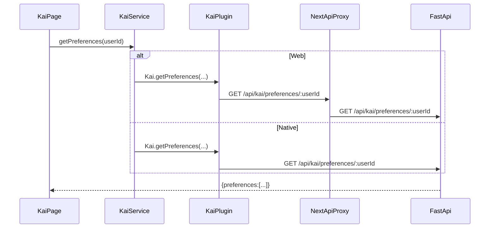

# Route Contracts (Web + Native + Backend)

> **Goal**: prevent endpoint drift, stale routes, and Capacitor breakages by making every API capability a declared contract: **Page → Service → (Web proxy or Native plugin) → FastAPI**.
>
> This doc pairs with the machine-checkable manifest: `hushh-webapp/route-contracts.json` and verifier script: `hushh-webapp/scripts/verify-route-contracts.cjs`.

---

## Core rules (non-negotiable)

- **Pages/components do not call `fetch()`** to backend endpoints. They call services.
- **Services** call:
  - **Web**: Next.js `app/api/**/route.ts` (proxy routes)
  - **Native**: Capacitor plugins (`hushh-webapp/lib/capacitor/**` + Swift/Kotlin)
- **BYOK / zero-knowledge**: vault key never leaves device; backend stores ciphertext only.
- **Consent-first**: writes require consent token; vault owner **reads AND writes** use **VAULT_OWNER token**.

**Token Requirements (January 2026 Update):**
- ✅ All vault data reads require VAULT_OWNER token
- ✅ All vault data writes require VAULT_OWNER token
- ✅ Backend validates tokens before serving encrypted data
- ✅ No authentication bypasses (even for vault owners)

---

## Canonical flow (Kai example)



---

## How to add a new API feature (required checklist)

1. **Backend**: add FastAPI endpoint in `consent-protocol/api/routes/*` and ensure it’s included from `consent-protocol/server.py`.
2. **Web**: add Next.js proxy route under `hushh-webapp/app/api/.../route.ts` (web only).
3. **Native**: add Capacitor plugin method in:
   - iOS: `hushh-webapp/ios/App/App/Plugins/*Plugin.swift`
   - Android: `hushh-webapp/android/app/src/main/java/com/hushh/app/plugins/**`
4. **TS plugin interface**: add/align in `hushh-webapp/lib/capacitor/**`.
5. **Service method**: expose a single method in `hushh-webapp/lib/services/**` (pages call this only).
6. **Route contract**: add it to `hushh-webapp/route-contracts.json`.
7. **Verify**: run `npm run verify:routes` in `hushh-webapp/`.

---

## Enforcement tooling

- **Manifest**: `hushh-webapp/route-contracts.json`
  - Declares which web routes exist, which backend router+paths they map to, and which native plugins must exist.
- **Verifier**: `hushh-webapp/scripts/verify-route-contracts.cjs`
  - Fails if an `app/api/**/route.ts` exists but is not declared (unless allowlisted).
  - Fails if a declared backend router prefix / route path cannot be found in the specified Python file.
  - Fails if required TS/native plugin files or method names are missing.

---

## 🔐 Token Requirements by Route

### Vault Data Access (Requires VAULT_OWNER Token)

| Web Route | Backend Route | Method | Token Required | Validation Function | Platform Support |
|-----------|---------------|--------|---------------|---------------------|------------------|
| `/api/vault/status` | `/db/vault/status` | GET (web) / POST (backend) | ✅ Yes | Session token | Web, iOS, Android |
| `/api/kai/preferences/:userId` | `/api/kai/preferences/:userId` | GET | ✅ Yes | Firebase verify | Web, iOS, Android |
| `/api/world-model/[...path]` | `/api/world-model/*` | Various | ✅ Yes | `require_vault_owner_token` | Web, iOS, Android |

> Vault domain data (e.g. financial, health) is served via **world-model** API; legacy food/professional routes were removed.

> Note: Web routes use GET with query params; backend routes use POST with JSON body.
> Native plugins call backend routes directly.

### Agent Operations (Requires Agent-Scoped Tokens)

| Route | Method | Token Required | Token Type | Validation Function |
|-------|--------|---------------|------------|---------------------|
| `/api/kai/analyze` | POST | ✅ Yes | Agent Scoped (`agent.kai.analyze`) | `validate_token(expected_scope)` |
| `/api/kai/consent/grant` | POST | ✅ Yes | Firebase ID | Firebase verify |

### Testing Token Enforcement

```bash
# Test vault status without token - should fail with 401
curl -X GET "http://localhost:3000/api/vault/status?userId=test123"
# Expected: 400 (missing consentToken) or 401 from backend

# Test with valid VAULT_OWNER token
curl -X GET "http://localhost:3000/api/vault/status?userId=test123&consentToken=HCT:..."
# Expected: {"domains": {"kai": {...}}, "totalActive": 1, "total": 1}
```

### Platform-Specific Token Routing

Domain data is served via **world-model** API (`/api/world-model/[...path]`). Use `WorldModelService` in the frontend; web uses Next.js proxy, native uses WorldModelPlugin. Token validation is identical across platforms.

---

## Response Format Transformation

### Backend → Service Layer Convention

| Layer | Format | Example |
|-------|--------|---------|
| Python Backend | snake_case | `{"user_id": "123", "display_name": "John"}` |
| Native Plugin | snake_case (passthrough) | `{"user_id": "123", "display_name": "John"}` |
| Service Layer | camelCase | `{"userId": "123", "displayName": "John"}` |
| React Component | camelCase | `user.userId`, `user.displayName` |

### Service Layer Responsibility

The service layer (`lib/services/*`) is responsible for:
1. Platform detection (`Capacitor.isNativePlatform()`)
2. Calling appropriate endpoint (native plugin or web proxy)
3. **Transforming snake_case to camelCase** for native responses
4. Returning consistent camelCase to React components

### Transformation Pattern

```typescript
// Service method with transformation
static async getData(userId: string): Promise<UserData> {
  if (Capacitor.isNativePlatform()) {
    const nativeResult = await Plugin.getData({ userId });
    // Transform snake_case to camelCase
    // eslint-disable-next-line @typescript-eslint/no-explicit-any
    const raw = nativeResult as any;
    return {
      userId: raw.user_id || raw.userId,
      displayName: raw.display_name || raw.displayName,
      createdAt: raw.created_at || raw.createdAt,
    };
  }
  // Web proxy - also returns snake_case from backend
  const response = await fetch(`/api/data?userId=${userId}`);
  const raw = await response.json();
  return {
    userId: raw.user_id || raw.userId,
    displayName: raw.display_name || raw.displayName,
    createdAt: raw.created_at || raw.createdAt,
  };
}
```

### Plugins Requiring Transformation

| Plugin | Methods | Status |
|--------|---------|--------|
| WorldModel | getMetadata, getAttributes, getUserDomains, listDomains, getAvailableScopes | Required |
| Kai | getInitialChatState, chat | Required |
| Identity | autoDetect, getIdentityStatus, getEncryptedProfile | Required |
| Vault | All crypto methods | Not needed |
| Consent | Token methods | Not needed |
