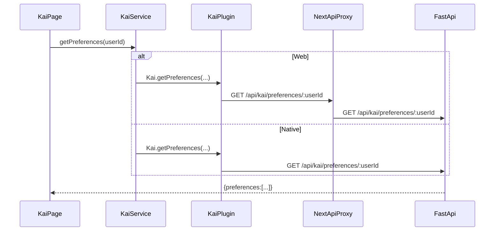

# Route Contracts (Web + Native + Backend)

> **Goal**: prevent endpoint drift, stale routes, and Capacitor breakages by making every API capability a declared contract: **Page → Service → (Web proxy or Native plugin) → FastAPI**.
>
> This doc pairs with the machine-checkable manifest: `hushh-webapp/route-contracts.json` and verifier script: `hushh-webapp/scripts/verify-route-contracts.ts`.

---

## Core rules (non-negotiable)

- **Pages/components do not call `fetch()`** to backend endpoints. They call services.
- **Services** call:
  - **Web**: Next.js `app/api/**/route.ts` (proxy routes)
  - **Native**: Capacitor plugins (`hushh-webapp/lib/capacitor/**` + Swift/Kotlin)
- **BYOK / zero-knowledge**: vault key never leaves device; backend stores ciphertext only.
- **Consent-first**: writes require consent token; vault owner **reads AND writes** use **VAULT_OWNER token**.

**Token Requirements (January 2026 Update):**
- ✅ All vault data reads require VAULT_OWNER token
- ✅ All vault data writes require VAULT_OWNER token
- ✅ Backend validates tokens before serving encrypted data
- ✅ No authentication bypasses (even for vault owners)

---

## Canonical flow (Kai example)



---

## How to add a new API feature (required checklist)

1. **Backend**: add FastAPI endpoint in `consent-protocol/api/routes/*` and ensure it’s included from `consent-protocol/server.py`.
2. **Web**: add Next.js proxy route under `hushh-webapp/app/api/.../route.ts` (web only).
3. **Native**: add Capacitor plugin method in:
   - iOS: `hushh-webapp/ios/App/App/Plugins/*Plugin.swift`
   - Android: `hushh-webapp/android/app/src/main/java/com/hushh/app/plugins/**`
4. **TS plugin interface**: add/align in `hushh-webapp/lib/capacitor/**`.
5. **Service method**: expose a single method in `hushh-webapp/lib/services/**` (pages call this only).
6. **Route contract**: add it to `hushh-webapp/route-contracts.json`.
7. **Verify**: run `npm run verify:routes` in `hushh-webapp/`.

---

## Enforcement tooling

- **Manifest**: `hushh-webapp/route-contracts.json`
  - Declares which web routes exist, which backend router+paths they map to, and which native plugins must exist.
- **Verifier**: `hushh-webapp/scripts/verify-route-contracts.ts`
  - Fails if an `app/api/**/route.ts` exists but is not declared (unless allowlisted).
  - Fails if a declared backend router prefix / route path cannot be found in the specified Python file.
  - Fails if required TS/native plugin files or method names are missing.

---

## 🔐 Token Requirements by Route

### Vault Data Access (Requires VAULT_OWNER Token)

| Web Route | Backend Route | Method | Token Required | Validation Function | Platform Support |
|-----------|---------------|--------|---------------|---------------------|------------------|
| `/api/vault/food/preferences` | `/api/food/preferences` | GET (web) / POST (backend) | ✅ Yes | `validate_vault_owner_token()` | Web, iOS, Android |
| `/api/vault/food` | `/api/food/preferences/store` | POST | ✅ Yes | `validate_vault_owner_token()` | Web, iOS, Android |
| `/api/vault/professional/preferences` | `/api/professional/preferences` | GET (web) / POST (backend) | ✅ Yes | `validate_vault_owner_token()` | Web, iOS, Android |
| `/api/vault/professional` | `/api/professional/preferences/store` | POST | ✅ Yes | `validate_vault_owner_token()` | Web, iOS, Android |
| `/api/vault/status` | `/db/vault/status` | GET (web) / POST (backend) | ✅ Yes | Session token | Web, iOS, Android |
| `/api/kai/preferences/:userId` | `/api/kai/preferences/:userId` | GET | ✅ Yes | Firebase verify | Web, iOS, Android |

> Note: Web routes use GET with query params; backend routes use POST with JSON body.
> Native plugins call backend routes directly.

### Agent Operations (Requires Agent-Scoped Tokens)

| Route | Method | Token Required | Token Type | Validation Function |
|-------|--------|---------------|------------|---------------------|
| `/api/kai/analyze` | POST | ✅ Yes | Agent Scoped (`agent.kai.analyze`) | `validate_token(expected_scope)` |
| `/api/kai/consent/grant` | POST | ✅ Yes | Firebase ID | Firebase verify |

### Testing Token Enforcement

```bash
# Test food preferences without token - should fail with 401
curl -X POST http://localhost:8000/api/vault/food/preferences \
  -H "Content-Type: application/json" \
  -d '{"userId": "test123"}'
# Expected: {"detail": "Missing consent token..."}

# Test with valid VAULT_OWNER token - should succeed
curl -X POST http://localhost:8000/api/vault/food/preferences \
  -H "Content-Type: application/json" \
  -d '{"userId": "test123", "consentToken": "HCT:eyJ0eXAiOiJKV1QiLCJhbGc..."}'
# Expected: {"domain": "food", "preferences": {...}}

# Test with wrong scope token - should fail with 403
curl -X POST http://localhost:8000/api/vault/food/preferences \
  -H "Content-Type: application/json" \
  -d '{"userId": "test123", "consentToken": "HCT:...agent.kai.analyze..."}'
# Expected: {"detail": "Insufficient scope..."}

# Test with expired token - should fail with 401
curl -X POST http://localhost:8000/api/vault/food/preferences \
  -H "Content-Type: application/json" \
  -d '{"userId": "test123", "consentToken": "HCT:expired_token"}'
# Expected: {"detail": "Invalid consent token: Token expired"}
```

### Platform-Specific Token Routing

#### Web Platform

```typescript
// Frontend: app/dashboard/food/page.tsx
const vaultOwnerToken = getVaultOwnerToken();
const response = await ApiService.getFoodPreferences(userId, vaultOwnerToken);

// ApiService: lib/services/api-service.ts
static async getFoodPreferences(userId: string, vaultOwnerToken: string) {
  // Web: Use Next.js proxy
  const url = `/api/vault/food/preferences?userId=${userId}&consentToken=${vaultOwnerToken}`;
  return fetch(url, { method: "GET" });
}

// Next.js Proxy: app/api/vault/food/route.ts
export async function GET(request: NextRequest) {
  const userId = searchParams.get("userId");
  const consentToken = searchParams.get("consentToken");
  
  // Forward to backend as POST with token in body
  const response = await fetch(`${PYTHON_API_URL}/api/vault/food/preferences`, {
    method: "POST",
    body: JSON.stringify({ userId, consentToken })
  });
}
```

#### Native Platform (iOS/Android)

```typescript
// Frontend: app/dashboard/food/page.tsx (SAME CODE)
const vaultOwnerToken = getVaultOwnerToken();
const response = await ApiService.getFoodPreferences(userId, vaultOwnerToken);

// ApiService: lib/services/api-service.ts (DETECTS PLATFORM)
static async getFoodPreferences(userId: string, vaultOwnerToken: string) {
  if (Capacitor.isNativePlatform()) {
    // Native: Use plugin (bypasses Next.js)
    const { preferences } = await HushhVault.getFoodPreferences({
      userId,
      vaultOwnerToken,  // Passed to native plugin
      authToken,
    });
    return new Response(JSON.stringify({ preferences }));
  }
  // ... web implementation ...
}
```

```swift
// iOS Plugin: HushhVaultPlugin.swift
@objc func getFoodPreferences(_ call: CAPPluginCall) {
    guard let userId = call.getString("userId"),
          let vaultOwnerToken = call.getString("vaultOwnerToken")
    else {
        call.reject("Missing required parameters")
        return
    }
    
    // Direct backend call with token
    let body: [String: Any] = [
        "userId": userId,
        "consentToken": vaultOwnerToken
    ]
    
    performRequest(
        urlStr: "\(backendUrl)/api/vault/food/preferences",
        method: "POST",
        body: body,
        call: call
    )
}
```

**Result:** Both web and native send `consentToken` to backend; validation is identical.
