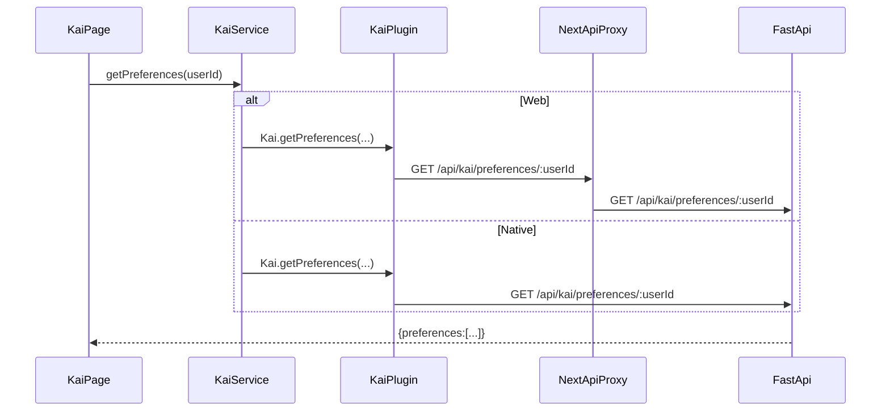

# Route Contracts (Web + Native + Backend)

> **Goal**: prevent endpoint drift, stale routes, and Capacitor breakages by making every API capability a declared contract: **Page → Service → (Web proxy or Native plugin) → FastAPI**.
>
> This doc pairs with the machine-checkable manifest: `hushh-webapp/route-contracts.json` and verifier script: `hushh-webapp/scripts/verify-route-contracts.ts`.

---

## Core rules (non-negotiable)

- **Pages/components do not call `fetch()`** to backend endpoints. They call services.
- **Services** call:
  - **Web**: Next.js `app/api/**/route.ts` (proxy routes)
  - **Native**: Capacitor plugins (`hushh-webapp/lib/capacitor/**` + Swift/Kotlin)
- **BYOK / zero-knowledge**: vault key never leaves device; backend stores ciphertext only.
- **Consent-first**: writes require consent token; vault owner writes use **VAULT_OWNER token**.

---

## Canonical flow (Kai example)

---

## How to add a new API feature (required checklist)

1. **Backend**: add FastAPI endpoint in `consent-protocol/api/routes/*` and ensure it’s included from `consent-protocol/server.py`.
2. **Web**: add Next.js proxy route under `hushh-webapp/app/api/.../route.ts` (web only).
3. **Native**: add Capacitor plugin method in:
   - iOS: `hushh-webapp/ios/App/App/Plugins/*Plugin.swift`
   - Android: `hushh-webapp/android/app/src/main/java/com/hushh/pda/plugins/**`
4. **TS plugin interface**: add/align in `hushh-webapp/lib/capacitor/**`.
5. **Service method**: expose a single method in `hushh-webapp/lib/services/**` (pages call this only).
6. **Route contract**: add it to `hushh-webapp/route-contracts.json`.
7. **Verify**: run `npm run verify:routes` in `hushh-webapp/`.

---

## Enforcement tooling

- **Manifest**: `hushh-webapp/route-contracts.json`
  - Declares which web routes exist, which backend router+paths they map to, and which native plugins must exist.
- **Verifier**: `hushh-webapp/scripts/verify-route-contracts.ts`
  - Fails if an `app/api/**/route.ts` exists but is not declared (unless allowlisted).
  - Fails if a declared backend router prefix / route path cannot be found in the specified Python file.
  - Fails if required TS/native plugin files or method names are missing.
