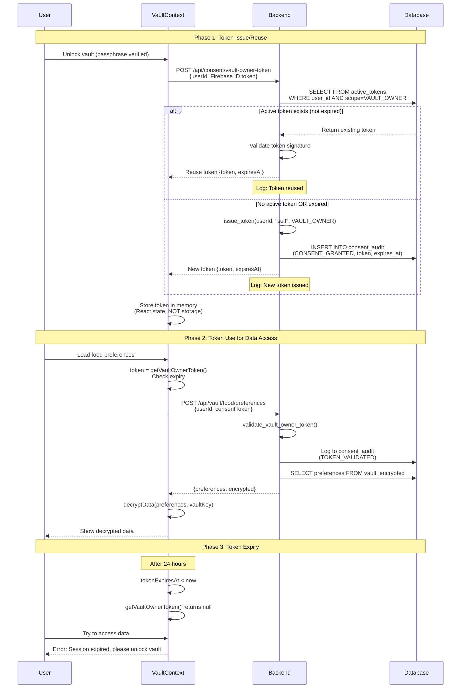

# Consent Protocol Implementation

> How the Hushh system implements consent-driven authentication and data access.

---

## 🎯 Overview

The consent protocol ensures that **every action on user data requires explicit, cryptographic permission**. This is implemented through a multi-layer security model with **NO authentication bypasses** - even vault owners use consent tokens.

### Consent-First Architecture

```
CORE PRINCIPLE: All data access requires a consent token.
                Vault owners are NOT special - they use VAULT_OWNER tokens.

Traditional     ❌  if (userOwnsVault) { allow(); }
Hushh Approach  ✅  if (validateToken(VAULT_OWNER)) { allow(); }
```

---

## 🔐 Security Layers

```
┌─────────────────────────────────────────────────────────────────┐
│                     User Authentication Flow                     │
├─────────────────────────────────────────────────────────────────┤
│ Layer 1: Firebase Auth    → OAuth (ACCOUNT - who you are)       │
│          Google Sign-In → Firebase ID token                     │
│                                                                  │
│ Layer 2: Vault Unlock     → Passphrase/Recovery (KNOWLEDGE)     │
│          Current: Passphrase (PBKDF2) or Recovery Key           │
│          Future: FaceID/TouchID/Passkey (passphrase fallback)   │
│          Combined with device biometric where available         │
│                                                                  │
│ Layer 3: VAULT_OWNER Token → Cryptographic Consent (DATA ACCESS)│
│          Issued after vault unlock, 24h expiry                  │
│                                                                  │
│ Layer 4: Agent Tokens     → Scoped Operations                   │
│          Domain-specific, 7-day expiry                          │
└─────────────────────────────────────────────────────────────────┘
```

### Layer 2: Vault Unlock (Current Implementation)

**Available Methods:**

1. **Passphrase Method** (Primary - Implemented ✅)

   - User-created passphrase
   - PBKDF2 key derivation (100k iterations)
   - Zero-knowledge (never sent to server)

2. **Recovery Key Method** (Backup - Implemented ✅)
   - 16-byte recovery key (HRK-xxxx-xxxx-xxxx-xxxx)
   - Generated during vault creation
   - Can unlock if passphrase forgotten

**Future Methods (Planned 🔜):**

3. **Passkey/WebAuthn** (Enhancement)

   - PRF extension for key derivation
   - Hardware-backed credentials
   - Passphrase becomes fallback

4. **Biometric Direct** (Enhancement)
   - FaceID/TouchID with Keychain/Keystore
   - Faster unlock experience
   - Passphrase as fallback mechanism

**Design Philosophy:**

- Passphrase/Recovery will always be available as fallback
- Biometric methods enhance UX but don't replace security
- User always has non-biometric option

---

## 🆕 VAULT_OWNER Token Architecture

### What is a VAULT_OWNER Token?

The **VAULT_OWNER token** is a special consent token with the `vault.owner` scope that grants vault owners full access to their own encrypted data.

**Key Properties:**

- **Scope**: `ConsentScope.VAULT_OWNER` (`"vault.owner"`)
- **Agent ID**: `"self"` (user is accessing their own data)
- **Expiry**: 24 hours (renewable)
- **Reuse**: Tokens are reused while valid (not recreated on every unlock)
- **Audit**: All issuance logged to `consent_audit` table

### Why VAULT_OWNER Tokens?

**Before** (❌ Insecure):

```python
# Old approach - bypassed consent protocol
if user_id == vault_owner:
    return encrypted_data  # No token validation!
```

**After** (✅ Secure):

```python
# New approach - uniform consent architecture
validate_vault_owner_token(token, user_id)
# Checks: signature, expiry, scope, userId match
return encrypted_data
```

**Benefits:**

1. ✅ **No Bypasses**: Vault owners follow same protocol as external agents
2. ✅ **Auditable**: All access logged, even by owner
3. ✅ **Consistent**: Same validation logic everywhere
4. ✅ **Compliance**: Clear audit trail for regulations
5. ✅ **Secure**: Token-based access prevents auth vulnerabilities

---

## 📋 Complete Authentication Flow

### 1. User Login (Firebase)

User authenticates via Google OAuth. Firebase issues an ID token.

```typescript
// Frontend
const result = await signInWithPopup(auth, googleProvider);
const idToken = await result.user.getIdToken();
```

### 2. Passphrase Verification (Frontend - Zero Knowledge)

User enters passphrase to unlock vault. **Passphrase never sent to server.**

```typescript
// components/vault/vault-flow.tsx
const vaultKeyHex = await VaultService.unlockVault(
  passphrase,
  vaultData.encryptedVaultKey,
  vaultData.salt,
  vaultData.iv
);
```

### 3. VAULT_OWNER Token Issuance (NEW!)

After successful passphrase verification, frontend requests VAULT_OWNER token:

```typescript
// components/vault/vault-flow.tsx - handleUnlockPassphrase()
if (decryptedKey) {
  // Get Firebase ID token
  const idToken = await auth.currentUser?.getIdToken();

  // Request VAULT_OWNER token from backend
  const { token, expiresAt } = await VaultService.issueVaultOwnerToken(
    userId,
    idToken
  );

  // Store in memory-only context
  unlockVault(decryptedKey, token, expiresAt);
}
```

### 4. Backend Verification & Token Issuance

Backend verifies Firebase ID token, checks for existing tokens, and issues new one if needed:

```python
# consent-protocol/api/routes/consent.py
@router.post("/vault-owner-token")
async def issue_vault_owner_token(request: Request):
    # 1. Verify Firebase ID token
    decoded_token = firebase_auth.verify_id_token(id_token)
    firebase_uid = decoded_token.get("uid")

    # 2. Ensure user requests token for their own vault
    if firebase_uid != user_id:
        raise HTTPException(403, "Cannot issue token for another user")

    # 3. Check for existing valid token (TOKEN REUSE)
    existing_token = await conn.fetchrow("""
        SELECT token_string, expires_at
        FROM consent_tokens
        WHERE user_id = $1 AND scope = 'vault.owner'
          AND expires_at > $2 AND revoked = FALSE
        LIMIT 1
    """, user_id, now_ms)

    if existing_token:
        # Reuse existing token ♻️
        return {
            "token": existing_token["token_string"],
            "expiresAt": existing_token["expires_at"],
            "scope": "vault.owner"
        }

    # 4. No valid token - issue new one 🔑
    token_obj = issue_token(
        user_id=user_id,
        agent_id="self",
        scope=ConsentScope.VAULT_OWNER,
        expires_in_ms=24 * 60 * 60 * 1000  # 24 hours
    )

    # 5. Log to audit table
    await insert_event(
        user_id=user_id,
        agent_id="self",
        scope="vault.owner",
        action="VAULT_OWNER_TOKEN_ISSUED",
        expires_at=token_obj.expires_at
    )

    return {
        "token": token_obj.token,
        "expiresAt": token_obj.expires_at,
        "scope": "vault.owner"
    }
```

### 5. Token Storage (Frontend)

Tokens stored in React Context (memory-only, not `sessionStorage` or `localStorage`):

```typescript
// lib/vault/vault-context.tsx
interface VaultContextType {
  vaultKey: string | null;
  vaultOwnerToken: string | null; // NEW!
  tokenExpiresAt: number | null; // NEW!
  unlockVault: (key: string, token: string, expiresAt: number) => void;
  getVaultOwnerToken: () => string | null; // Auto-validates expiry
}
```

**Security Benefits:**

- ✅ Memory-only = XSS protection
- ✅ Lost on page refresh = Session security
- ✅ Never persisted = No lingering access

### 6. Using VAULT_OWNER Token

When accessing vault data, frontend passes token to backend:

```typescript
// Frontend - accessing food preferences
const token = getVaultOwnerToken(); // Auto-checks expiry
const response = await fetch("/api/food/preferences", {
  method: "POST",
  body: JSON.stringify({
    userId,
    consentToken: token, // Required!
  }),
});
```

Backend validates token before returning data:

```python
# consent-protocol/api/routes/food.py
@router.post("/preferences")
async def get_food_preferences(request: Request):
    body = await request.json()
    user_id = body.get("userId")
    consent_token = body.get("consentToken")

    # Validate VAULT_OWNER token
    validate_vault_owner_token(consent_token, user_id)
    # Checks: signature, expiry, scope=vault.owner, userId match

    # Fetch encrypted preferences
    return {"preferences": encrypted_data}
```

### 7. Logout

On logout, tokens are destroyed:

```typescript
// components/navigation.tsx - handleLogout()
lockVault(); // Clears vaultKey + vaultOwnerToken from memory
await signOut(auth);
```

---

## 🏗️ Token Validation Helper

Modular agents (Food, Professional) use a shared validation helper that supports **Hierarchical Scope Validation**:

```python
# api/routes/food.py & api/routes/professional.py
def validate_vault_owner_token(consent_token: str, user_id: str) -> None:
    """
    Validate VAULT_OWNER consent token.
    Raises HTTPException if validation fails.
    """
    if not consent_token:
        raise HTTPException(401, "Missing consent token")

    # 1. Validate token (signature, expiry)
    valid, reason, token_obj = validate_token(consent_token, ConsentScope.VAULT_OWNER)
    if not valid:
        # HIERARCHICAL FALLBACK:
        # If VAULT_OWNER fails, we do NOT automatically fail if the token
        # has a more specific scope. However, for "Owner" routes,
        # strictly vault.owner is often preferred.
        raise HTTPException(401, f"Invalid token: {reason}")

    # ...
```

### Hierarchical Scope Validation (NEW)

The `validate_token` function in `hushh_mcp/consent/token.py` has been upgraded to support **Master Scopes**.

- **Master Scope**: `vault.owner`
- **Logic**: If a token has the `vault.owner` scope, it is treated as a master key that satisfies **any** `expected_scope` requirement (e.g., `agent.kai.analyze`).

This allows the system to remain compliant with the **Principle of Least Privilege** for third-party agents, while giving the user (via the Vault Owner token) universal access to their own analysis tools without needing multiple distinct tokens.

```python
# hushh_mcp/consent/token.py
if expected_scope and scope_str != expected_scope.value:
    # HIERARCHICAL VALIDATION:
    # vault.owner satisfies ANY specific agent scope
    if scope_str == ConsentScope.VAULT_OWNER.value:
        logger.info(f"Master Scope 'vault.owner' satisfying requirement for {expected_scope.value}")
    else:
        return False, "Scope mismatch", None
```

---

## 🗄️ Database Tables

### consent_tokens (NEW!)

Stores all consent tokens including VAULT_OWNER tokens:

```sql
CREATE TABLE consent_tokens (
  id SERIAL PRIMARY KEY,
  user_id TEXT NOT NULL,
  agent_id TEXT NOT NULL,  -- 'self' for VAULT_OWNER
  scope TEXT NOT NULL,      -- 'vault.owner' for VAULT_OWNER
  token_string TEXT NOT NULL,
  issued_at BIGINT NOT NULL,
  expires_at BIGINT NOT NULL,
  revoked BOOLEAN DEFAULT FALSE,
  created_at TIMESTAMPTZ DEFAULT NOW()
);

CREATE INDEX idx_consent_tokens_lookup
  ON consent_tokens(user_id, agent_id, scope, expires_at);
```

### consent_audit

Logs all consent actions including VAULT_OWNER token issuance:

```sql
CREATE TABLE consent_audit (
  id SERIAL PRIMARY KEY,
  token_id TEXT NOT NULL,
  user_id TEXT NOT NULL,
  agent_id TEXT NOT NULL,  -- 'self' for vault owner
  scope TEXT NOT NULL,      -- 'vault.owner' for VAULT_OWNER
  action TEXT NOT NULL,     -- 'VAULT_OWNER_TOKEN_ISSUED'
  issued_at BIGINT NOT NULL,
  expires_at BIGINT,
  revoked_at BIGINT,
  metadata JSONB,
  ip_address VARCHAR(45),
  user_agent TEXT
);
```

**Example audit entry**:

```json
{
  "user_id": "user123",
  "agent_id": "self",
  "scope": "vault.owner",
  "action": "VAULT_OWNER_TOKEN_ISSUED",
  "issued_at": 1735968000000,
  "expires_at": 1736054400000
}
```

---

## 🔗 API Endpoints

### VAULT_OWNER Token Endpoints

| Endpoint                         | Method | Purpose                                                    |
| -------------------------------- | ------ | ---------------------------------------------------------- |
| `/api/consent/vault-owner-token` | POST   | Issue/reuse VAULT_OWNER token (requires Firebase ID token) |

### Modular Agent Endpoints (NEW!)

| Endpoint                              | Method | Purpose                           | Requires Token |
| ------------------------------------- | ------ | --------------------------------- | -------------- |
| `/api/food/preferences`               | POST   | Get encrypted food data           | VAULT_OWNER    |
| `/api/food/preferences/store`         | POST   | Store encrypted food data         | VAULT_OWNER    |
| `/api/professional/preferences`       | POST   | Get encrypted professional data   | VAULT_OWNER    |
| `/api/professional/preferences/store` | POST   | Store encrypted professional data | VAULT_OWNER    |

### Legacy Endpoints (Deprecated)

| Endpoint               | Status        | Migration Path                      |
| ---------------------- | ------------- | ----------------------------------- |
| `/db/food/get`         | ⚠️ DEPRECATED | Use `/api/food/preferences`         |
| `/db/professional/get` | ⚠️ DEPRECATED | Use `/api/professional/preferences` |

See deprecation warnings in `api/routes/db_proxy.py`.

---

## 🛡️ Security Guarantees

### VAULT_OWNER Token Security

1. ✅ **Firebase Verification**: Backend validates Firebase ID token before issuing
2. ✅ **Token Reuse**: Existing valid tokens returned instead of creating duplicates
3. ✅ **Scope Enforcement**: All agents validate `scope = "vault.owner"`
4. ✅ **User ID Binding**: Token userId must match request userId
5. ✅ **Signature Validation**: HMAC-SHA256 signature checked on every request
6. ✅ **Expiry Check**: Tokens expire after 24 hours
7. ✅ **Memory-Only Storage**: Frontend stores in React Context (XSS protected)
8. ✅ **Audit Trail**: All token issuance logged to `consent_audit`

### Traditional Security Features (Unchanged)

1. **No passphrase on server** - Zero-knowledge design
2. **Logout destroys tokens** - No lingering access
3. **Export zero-knowledge** - MCP access never exposes plaintext to server

---

## 🔄 Token Lifecyle

```
┌─────────────────────────────────────────────────────────────────┐
│                    VAULT_OWNER TOKEN LIFECYCLE                   │
├─────────────────────────────────────────────────────────────────┤
│                                                                  │
│ 1. ISSUANCE                                                      │
│    User unlocks vault → Backend issues token → Stored in DB     │
│                                                                  │
│ 2. REUSE                                                         │
│    User unlocks again → Backend finds existing → Returns same   │
│                         (while valid)                            │
│                                                                  │
│ 3. VALIDATION                                                    │
│    Every API call → validate_vault_owner_token() → Allow/Deny   │
│                                                                  │
│ 4. EXPIRY                                                        │
│    After 24h → Token invalid → User must unlock again           │
│                                                                  │
│ 5. LOGOUT                                                        │
│    User logs out → Token cleared from memory → Session ended    │
│                                                                  │
└─────────────────────────────────────────────────────────────────┘
```

---

## 🎛️ Platform-Aware Routing

VAULT_OWNER token issuance works across all platforms:

```
┌──────────────────────────────────────────────────────────────┐
│              VAULT_OWNER TOKEN - PLATFORM ROUTING             │
├──────────────────────────────────────────────────────────────┤
│                                                               │
│ WEB                                                           │
│  Frontend → /api/consent/vault-owner-token (Next.js proxy)   │
│          → Backend /api/consent/vault-owner-token            │
│                                                               │
│ iOS                                                           │
│  Frontend → HushhConsent.issueVaultOwnerToken() (Swift)      │
│          → Backend /api/consent/vault-owner-token            │
│                                                               │
│ ANDROID                                                       │
│  Frontend → HushhConsent.issueVaultOwnerToken() (Kotlin)     │
│          → Backend /api/consent/vault-owner-token            │
│                                                               │
└──────────────────────────────────────────────────────────────┘
```

**Native Plugin Implementation**:

- **iOS**: `ios/App/App/Plugins/HushhConsentPlugin.swift`
- **Android**: `android/.../HushhConsentPlugin.kt`
- **Interface**: `lib/capacitor/index.ts`

- **Android**: `android/.../HushhConsentPlugin.kt`
- **Interface**: `lib/capacitor/index.ts`

---

## 🔄 VAULT_OWNER Token Lifecycle (Detailed)

### Complete Lifecycle Diagram



### Token Lifecycle States

| State          | Duration | Trigger                       | Actions                                                    |
| -------------- | -------- | ----------------------------- | ---------------------------------------------------------- |
| **Not Issued** | -        | Initial state or after expiry | No vault access possible                                   |
| **Active**     | 24 hours | Vault unlock                  | Stored in VaultContext memory, reusable for all operations |
| **Expired**    | -        | After 24 hours                | Cleared from context, user must unlock vault again         |
| **Revoked**    | -        | User logs out or locks vault  | Immediately cleared from memory                            |

### Token Reuse Logic (Backend)

**File:** `consent-protocol/api/routes/consent.py:277-310`

```python
# Check for existing active VAULT_OWNER token
now_ms = int(time.time() * 1000)
active_tokens = await consent_db.get_active_tokens(user_id)

for token in active_tokens:
    # Match scope and verify expiry
    if token.get("scope") == ConsentScope.VAULT_OWNER.value:
        expires_at = token.get("expires_at", 0)

        # Reuse if token has > 1 hour left
        if expires_at > now_ms + (60 * 60 * 1000):
            candidate_token = token.get("token_id")

            # Validate signature before reusing
            is_valid, reason, payload = validate_token(
                candidate_token,
                ConsentScope.VAULT_OWNER
            )

            if is_valid:
                logger.info(f"♻️ Reusing VAULT_OWNER token for {user_id}")
                return {
                    "token": candidate_token,
                    "expiresAt": expires_at
                }

# No valid token found - issue new one
token_obj = issue_token(
    user_id=user_id,
    agent_id="self",
    scope=ConsentScope.VAULT_OWNER,
    expires_in_ms=24 * 60 * 60 * 1000
)
```

---

## 🆚 Token Types Comparison

| Token Type        | Scope               | Duration | Issuer                 | Use Case                     | Revocable | Example                          |
| ----------------- | ------------------- | -------- | ---------------------- | ---------------------------- | --------- | -------------------------------- |
| **VAULT_OWNER**   | `vault.owner`       | 24h      | Backend (user request) | User's own data operations   | Yes       | Read/write food preferences      |
| **Agent Scoped**  | `agent.kai.analyze` | 7 days   | Backend (user consent) | AI agent operations          | Yes       | Kai analyze stock                |
| **MCP Read-Only** | Domain-specific     | Session  | MCP Server             | External AI (Claude, Cursor) | Yes       | Read preferences for suggestions |
| **Firebase ID**   | N/A                 | 1 hour   | Firebase               | Identity verification only   | N/A       | Backend auth header              |

### When to Use Each Token

```typescript
// VAULT_OWNER: For user's own vault operations
const response = await ApiService.getFoodPreferences(
  userId,
  vaultOwnerToken // Required for all vault reads/writes
);

// Agent-Scoped: For AI agent operations
const analysis = await Kai.analyze({
  userId,
  ticker: "AAPL",
  consentToken: kaiToken, // Scoped to analysis only
});

// Firebase ID: For backend identity verification
const headers = {
  Authorization: `Bearer ${firebaseIdToken}`,
};
```

---

## 📋 Complete Scope Reference

All consent scopes defined in `hushh_mcp/constants.py`:

### Master Scope

| Scope | Value | Description |
|-------|-------|-------------|
| **VAULT_OWNER** | `vault.owner` | Master scope - satisfies ANY other scope. Granted only to vault owner via BYOK login. Never granted to external agents. |

### Vault Read Scopes

| Scope | Value | Description |
|-------|-------|-------------|
| **VAULT_READ_FOOD** | `vault.read.food` | Read dietary preferences, cuisines, budget |
| **VAULT_READ_PROFESSIONAL** | `vault.read.professional` | Read career profile, skills, preferences |
| **VAULT_READ_FINANCE** | `vault.read.finance` | Read ALL financial data (risk profile, decisions, preferences) |

### Vault Write Scopes

| Scope | Value | Description |
|-------|-------|-------------|
| **VAULT_WRITE_FOOD** | `vault.write.food` | Save dietary preferences |
| **VAULT_WRITE_PROFESSIONAL** | `vault.write.professional` | Save career profile data |
| **VAULT_WRITE_FINANCE** | `vault.write.finance` | Save ALL financial data (risk profile, decisions, preferences) |

### Agent Operation Scopes

| Scope | Value | Description | Agent |
|-------|-------|-------------|-------|
| **AGENT_KAI_ANALYZE** | `agent.kai.analyze` | Perform investment analysis (SEC data, sentiment, valuation) | Kai |
| **AGENT_FOOD_COLLECT** | `agent.food.collect` | Collect dietary preferences via conversation | Food & Dining |
| **AGENT_FINANCE_ANALYZE** | `agent.finance.analyze` | General financial analysis | Generic |
| **AGENT_SHOPPING_PURCHASE** | `agent.shopping.purchase` | Execute purchases (planned) | Shopping |

### Scope Hierarchy

```
vault.owner (Master)
    └── Satisfies ALL other scopes
        ├── vault.read.*
        ├── vault.write.*
        └── agent.*
```

**Important**: When `vault.owner` token is validated against any scope (e.g., `agent.kai.analyze`), validation passes. This allows vault owners to use all their own agents without separate tokens.

### Kai Agent Scope Model (Simplified)

Kai uses only **3 core scopes**:

| Scope | Purpose | Used By |
|-------|---------|---------|
| `vault.read.finance` | Read all financial data (risk profile, decisions, preferences) | All Kai tools |
| `vault.write.finance` | Write all financial data (decisions, preferences) | Decision storage |
| `agent.kai.analyze` | Execute analysis operations | External agents only |

**Vault owners** use their `vault.owner` token which satisfies all three scopes.
**External agents** must request `agent.kai.analyze` scope explicitly.

### Per-Agent Scope Requirements

**Kai Agent** (`agents/kai/agent.yaml`):
- `vault.read.finance` - Read risk profile, decision history, preferences
- `vault.write.finance` - Store analysis decisions
- `agent.kai.analyze` - For external agent delegation only

**Food & Dining Agent** (`agents/food_dining/agent.yaml`):
- `vault.read.food` - Read preferences
- `vault.read.finance` - Analyze spending
- `vault.write.food` - Save preferences

**Professional Agent** (`agents/professional_profile/agent.yaml`):
- `vault.read.professional` - Read profile
- `vault.write.professional` - Save profile

---

## 📊 Audit Logging Behavior

The `consent_audit` table correctly tracks WHO is accessing data:

### Vault Owner vs External Agent

| User Type | agent_id | scope | When |
|-----------|----------|-------|------|
| **Vault Owner** | `self` | `vault.owner` | Owner accesses their own Kai |
| **External Agent** | `agent_kai` | `agent.kai.analyze` | Third-party agent accesses via delegation |

### Correct Audit Flow for Kai

**When vault owner clicks "Analyze AAPL":**
```
1. Frontend checks vaultOwnerToken (from VaultContext)
2. Analysis uses vault.owner token directly
3. Backend validates vault.owner scope
4. Audit logs: agent_id="self", scope="vault.owner"
```

**When external agent requests analysis:**
```
1. External agent requests agent.kai.analyze token
2. User approves consent request
3. Backend issues agent.kai.analyze token
4. Audit logs: agent_id="agent_kai", scope="agent.kai.analyze"
```

This ensures compliance audit trails correctly identify vault owners vs delegated agents

---

## 🔐 All Data Access Requires VAULT_OWNER Token

### Vault Operations Matrix

| Operation | Web Route | Backend Route | Method | Token Required | Token Type |
|-----------|-----------|---------------|--------|----------------|------------|
| Read food preferences | `/api/vault/food/preferences` | `/api/food/preferences` | GET→POST | ✅ Yes | VAULT_OWNER |
| Write food preferences | `/api/vault/food` | `/api/food/preferences/store` | POST | ✅ Yes | VAULT_OWNER |
| Read professional profile | `/api/vault/professional/preferences` | `/api/professional/preferences` | GET→POST | ✅ Yes | VAULT_OWNER |
| Write professional profile | `/api/vault/professional` | `/api/professional/preferences/store` | POST | ✅ Yes | VAULT_OWNER |
| Read Kai preferences | `/api/kai/preferences/:userId` | `/api/kai/preferences/:userId` | GET | ✅ Yes | Firebase ID |
| Kai analyze stock | `/api/kai/analyze` | `/api/kai/analyze` | POST | ✅ Yes | Agent Scoped |

> Note: Web routes use GET with query params; backend routes use POST with JSON body containing `userId` and `consentToken`. Native plugins call backend routes directly.

### Platform Routing with Tokens

#### Web Platform

```
Dashboard → ApiService → Next.js Proxy (/api/vault/food/preferences) → Backend
                                ↓
                    GET with token in query params
                                ↓
                    Proxy converts to POST with token in body
                                ↓
                    Backend validates VAULT_OWNER token
```

#### Native Platform (iOS/Android)

```
Dashboard → ApiService → Capacitor Plugin (HushhVault) → Backend (direct)
                                ↓
                    Plugin receives vaultOwnerToken parameter
                                ↓
                    POST /api/vault/food/preferences {userId, consentToken}
                                ↓
                    Backend validates VAULT_OWNER token
```

**Both paths converge at backend validation—no platform bypasses.**

---

## 📝 Audit Logging

### What Gets Logged

Every token operation is logged to the `consent_audit` table:

| Event                     | Action                    | Logged Fields                                             |
| ------------------------- | ------------------------- | --------------------------------------------------------- |
| Token issued              | `CONSENT_GRANTED`         | user_id, agent_id, scope, token_id, expires_at, timestamp |
| Token validated (success) | `TOKEN_VALIDATED`         | user_id, agent_id, scope, token_id, timestamp             |
| Token validation failed   | `TOKEN_VALIDATION_FAILED` | user_id, reason, timestamp                                |
| Token reused              | `TOKEN_REUSED`            | user_id, token_id, timestamp                              |
| Token expired             | `TOKEN_EXPIRED`           | user_id, token_id, timestamp                              |

### Audit Trail Export

```python
# Generate audit report for user (CCPA compliance)
SELECT
    timestamp,
    action,
    agent_id,
    scope,
    metadata
FROM consent_audit
WHERE user_id = 'user123'
ORDER BY timestamp DESC;
```

### Retention Policy

- **Duration**: 2 years (CCPA requirement)
- **Immutability**: Append-only table (no updates/deletes)
- **User Access**: Exportable via API
- **Regulatory**: Available for compliance audits

---

## ⚖️ Compliance Mappings

### CCPA (California Consumer Privacy Act)

| CCPA Requirement     | Hushh Implementation                                          |
| -------------------- | ------------------------------------------------------------- |
| **Right to Know**    | User can export `consent_audit` table showing all data access |
| **Right to Delete**  | Token revocation + vault deletion with audit trail            |
| **Right to Opt-Out** | No data sharing without explicit consent tokens               |
| **Proof of Consent** | Cryptographic tokens = verifiable consent                     |
| **Access Logging**   | Every vault access logged with token validation               |

### GDPR (General Data Protection Regulation)

| GDPR Requirement       | Hushh Implementation                        |
| ---------------------- | ------------------------------------------- |
| **Lawful Basis**       | Consent tokens = explicit, informed consent |
| **Consent Management** | Token expiry, revocation, audit trail       |
| **Data Minimization**  | Scoped tokens limit agent access            |
| **Right to Access**    | Export `consent_audit` + vault data         |
| **Right to Erasure**   | Vault deletion + token revocation           |

### SEC (Securities and Exchange Commission)

For Agent Kai regulatory compliance:

| SEC Concern        | Hushh Implementation                              |
| ------------------ | ------------------------------------------------- |
| **Audit Trail**    | Every Kai analysis logged with VAULT_OWNER token  |
| **User Consent**   | Explicit token-based consent for each analysis    |
| **Fiduciary Duty** | Token system proves data access authorization     |
| **Recordkeeping**  | Immutable `consent_audit` table, 2-year retention |
| **Disclosure**     | Token scopes clearly define agent capabilities    |

---

## 📡 MCP External Consent (Third-Party Agents)

_[Previous MCP consent flow documentation remains unchanged]_

When external AI agents (Claude Desktop, Cursor, etc.) request access to user data, a special **zero-knowledge export** flow is used with agent-specific tokens (not VAULT_OWNER tokens).

---

## 🧪 Testing & Verification

### Testing Token Reuse

```bash
# 1. First unlock - creates new token
curl -X POST https://backend.example.com/api/consent/vault-owner-token \
  -H "Authorization: Bearer $FIREBASE_TOKEN" \
  -d '{"userId": "user123"}'
# Backend logs: "🔑 Issuing NEW VAULT_OWNER token"

# 2. Lock and unlock again (within 24h) - reuses token
curl -X POST https://backend.example.com/api/consent/vault-owner-token \
  -H "Authorization: Bearer $FIREBASE_TOKEN" \
  -d '{"userId": "user123"}'
# Backend logs: "♻️ Reusing existing VAULT_OWNER token"
```

### Testing Token Validation

```bash
# Valid VAULT_OWNER token
curl -X POST https://backend.example.com/api/food/preferences \
  -d '{"userId": "user123", "consentToken": "HCT:..."}'
# Returns: {"preferences": {...}}

# Missing token
curl -X POST https://backend.example.com/api/food/preferences \
  -d '{"userId": "user123"}'
# Returns: 401 "Missing consent token"

# Wrong scope token
curl -X POST https://backend.example.com/api/food/preferences \
  -d '{"userId": "user123", "consentToken": "HCT:...food.read..."}'
# Returns: 403 "Insufficient scope"
```

---

## 📊 Migration from Legacy Architecture

### Old Approach (Insecure)

```python
# ❌ OLD: db_proxy.py - CRITICAL SECURITY VULNERABILITY
@router.post("/db/food/get")
async def get_food_data(request: Request):
    body = await request.json()
    user_id = body.get("userId")

    # NO AUTHENTICATION! Anyone with userId can access data
    return encrypted_data
```

### New Approach (Secure)

```python
# ✅ NEW: api/routes/food.py - Consent-First Architecture
@router.post("/api/food/preferences")
async def get_food_preferences(request: Request):
    body = await request.json()
    user_id = body.get("userId")
    consent_token = body.get("consentToken")

    # VAULT_OWNER token required!
    validate_vault_owner_token(consent_token, user_id)

    return encrypted_data
```

### Migration Checklist

- [x] Backend `/api/consent/vault-owner-token` endpoint created
- [x] Modular Food agent (`/api/food/preferences`) created
- [x] Modular Professional agent (`/api/professional/preferences`) created
- [x] VaultContext updated to store VAULT_OWNER token
- [x] Vault unlock flow integrated with token request
- [x] iOS Swift plugin implemented
- [x] Android Kotlin plugin implemented
- [x] Token reuse logic implemented
- [x] Legacy routes deprecated with warnings
- [x] Frontend API calls updated to pass tokens (January 2026)
- [x] End-to-end token validation tested on web/iOS/Android
- [x] Audit logging implemented
- [x] Compliance mappings documented

---

_Version: 6.0 | Updated: January 14, 2026 | Complete VAULT_OWNER Token Lifecycle + Compliance Mappings_
