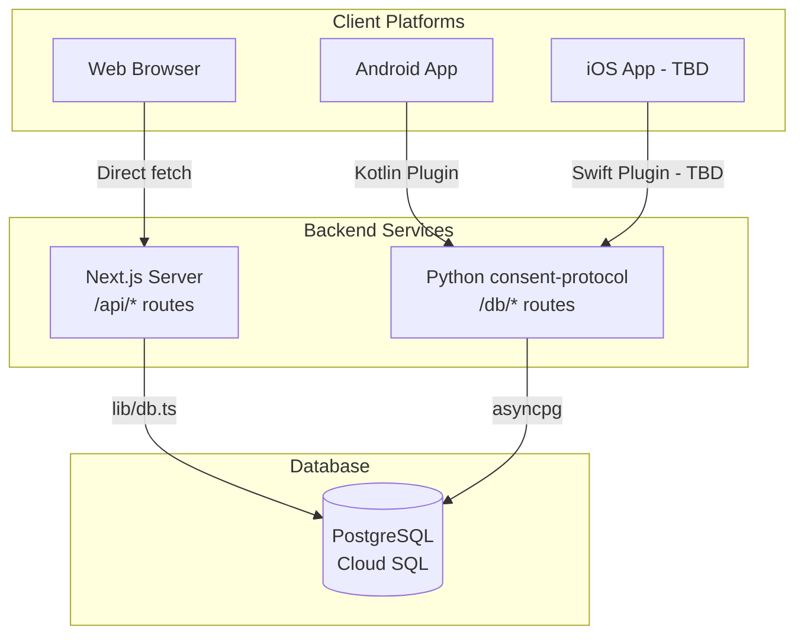

# Hushh Platform Architecture Guide

## Overview

This document describes how the Hushh PDA (Personal Data Agent) handles data retrieval across different platforms: Web, Android, and iOS.

## Architecture Diagram



---

## Web Platform

### Architecture

- **Runtime:** Next.js Server (SSR/SSG hybrid)
- **API Routes:** `/api/vault/*` (server-side Node.js)
- **Database:** Direct PostgreSQL via `lib/db.ts`

### Data Flow

```
Browser → fetch('/api/vault/food') → Next.js API Route → PostgreSQL → Response
```

### Key Files

| File                                                                                                                                             | Purpose                                                       |
| ------------------------------------------------------------------------------------------------------------------------------------------------ | ------------------------------------------------------------- |
| [`app/api/vault/food/route.ts`](file:///c:/OneDrive%20-%20NS/Repository/hushh-research/hushh-webapp/app/api/vault/food/route.ts)                 | Food preferences GET/POST                                     |
| [`app/api/vault/professional/route.ts`](file:///c:/OneDrive%20-%20NS/Repository/hushh-research/hushh-webapp/app/api/vault/professional/route.ts) | Professional profile GET/POST                                 |
| [`lib/db.ts`](file:///c:/OneDrive%20-%20NS/Repository/hushh-research/hushh-webapp/lib/db.ts)                                                     | Database queries (`getAllFoodData`, `getAllProfessionalData`) |
| [`lib/services/api-service.ts`](file:///c:/OneDrive%20-%20NS/Repository/hushh-research/hushh-webapp/lib/services/api-service.ts)                 | Platform-aware API wrapper                                    |

### Token Validation

Session tokens are validated in API routes:

```typescript
// app/api/vault/food/route.ts
const sessionToken = extractSessionToken(request);
const validation = await validateSessionToken(sessionToken);
if (!validation.valid) return 403;
```

---

## Android Platform

### Architecture

- **Runtime:** Static HTML/JS export (no server-side code)
- **Native Plugin:** Kotlin (`HushhVaultPlugin.kt`)
- **Backend:** Python consent-protocol on Cloud Run

### Why Static Export?

Capacitor Android uses `output: "export"` in Next.js config, which generates static files. **No `/api/*` routes exist** in the Android bundle.

### Data Flow

```
WebView → ApiService.getFoodPreferences()
       → HushhVault.getFoodPreferences() [Capacitor Plugin]
       → Kotlin Plugin HTTP Request
       → Python Backend POST /db/food/get
       → PostgreSQL → Response
```

### Key Files

| File                                                                                                                                                                                    | Purpose                            |
| --------------------------------------------------------------------------------------------------------------------------------------------------------------------------------------- | ---------------------------------- |
| [`android/.../HushhVaultPlugin.kt`](file:///c:/OneDrive%20-%20NS/Repository/hushh-research/hushh-webapp/android/app/src/main/java/com/hushh/pda/plugins/HushhVault/HushhVaultPlugin.kt) | Native HTTP calls to backend       |
| [`lib/capacitor/index.ts`](file:///c:/OneDrive%20-%20NS/Repository/hushh-research/hushh-webapp/lib/capacitor/index.ts)                                                                  | Plugin interface definitions       |
| [`lib/services/api-service.ts`](file:///c:/OneDrive%20-%20NS/Repository/hushh-research/hushh-webapp/lib/services/api-service.ts)                                                        | Routes to native plugin on Android |
| [`consent-protocol/api/routes/db_proxy.py`](file:///c:/OneDrive%20-%20NS/Repository/hushh-research/consent-protocol/api/routes/db_proxy.py)                                             | Python endpoints for native apps   |

### Backend Endpoints (Python)

| Endpoint               | Method | Purpose                  |
| ---------------------- | ------ | ------------------------ |
| `/db/vault/check`      | POST   | Check if vault exists    |
| `/db/vault/get`        | POST   | Get encrypted vault key  |
| `/db/vault/setup`      | POST   | Store vault key          |
| `/db/food/get`         | POST   | Get food preferences     |
| `/db/professional/get` | POST   | Get professional profile |

### Kotlin Plugin Example

```kotlin
// HushhVaultPlugin.kt
@PluginMethod
fun getFoodPreferences(call: PluginCall) {
    val url = "$backendUrl/db/food/get"
    val jsonBody = JSONObject().apply { put("userId", userId) }

    // POST request with auth headers
    val request = Request.Builder()
        .url(url)
        .post(jsonBody.toRequestBody())
        .addHeader("Authorization", "Bearer $authToken")
        .build()

    httpClient.newCall(request).execute()
}
```

---

## iOS Platform (TBD)

### Planned Architecture

- **Runtime:** Static HTML/JS export (same as Android)
- **Native Plugin:** Swift (`HushhVaultPlugin.swift`)
- **Backend:** Same Python consent-protocol

### Data Flow (Planned)

```
WKWebView → ApiService.getFoodPreferences()
         → HushhVault.getFoodPreferences() [Capacitor Plugin]
         → Swift Plugin URLSession Request
         → Python Backend POST /db/food/get
         → PostgreSQL → Response
```

### Key Files (To Implement)

| File                                                    | Status |
| ------------------------------------------------------- | ------ |
| `ios/App/App/Plugins/HushhVault/HushhVaultPlugin.swift` | TBD    |
| `ios/App/App/Plugins/HushhVault/HushhVaultPlugin.m`     | TBD    |

### Implementation Checklist

- [ ] Create `HushhVaultPlugin.swift` matching Kotlin plugin methods
- [ ] Register plugin in `AppDelegate.swift`
- [ ] Test with same Python backend endpoints
- [ ] Verify session token handling

---

## Platform Detection

The `ApiService` automatically routes to the correct implementation:

```typescript
// lib/services/api-service.ts
static async getFoodPreferences(userId: string, sessionToken?: string) {
    if (Capacitor.isNativePlatform()) {
        // Android/iOS: Use native plugin → Python backend
        const authToken = await this.getFirebaseToken();
        const { preferences } = await HushhVault.getFoodPreferences({
            userId, authToken, sessionToken
        });
        return new Response(JSON.stringify({ preferences }));
    }

    // Web: Use Next.js API route directly
    return apiFetch(`/api/vault/food?userId=${userId}`);
}
```

---

## Environment Configuration

### Web (.env.local)

```env
DATABASE_URL=postgresql://...
NEXT_PUBLIC_BACKEND_URL=https://consent-protocol-xxx.run.app
```

### Android

Backend URL is hardcoded in `HushhVaultPlugin.kt`:

```kotlin
private val defaultBackendUrl = "https://consent-protocol-1006304528804.us-central1.run.app"
```

### iOS (TBD)

Will use same pattern as Android.

---

## Troubleshooting

### Android: "404 Not Found" on food/professional data

1. Verify consent-protocol is deployed with latest `/db/food/get` endpoint
2. Check logs: `adb logcat | grep HushhVault`
3. Verify `defaultBackendUrl` in Kotlin plugin

### Web: API routes return 500

1. Check `DATABASE_URL` is set in environment
2. Verify PostgreSQL connection: `lib/db.ts` logs

### General: Token validation fails

1. Session token must be obtained via `/api/consent/session-token`
2. Token must not be expired (24h default)
3. User ID in token must match requested data
