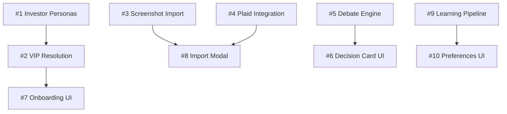

# GitHub Issues: Kai Phase 2 Sprint

> Copy these to GitHub Issues for team collaboration

---

## Epic Overview

**Epic**: Kai Phase 2 - Investor Intelligence
**Sprint Duration**: 10 weeks
**Team**: @kusha (Backend/AI), @ankit (UI/UX)
**Architecture**: Cloud-based (Gemini API, Cloud Vision)

---

## Issue #1: Top 1024 Investor Pre-Created Personas

### Metadata

- **Assignee**: @kusha
- **Labels**: `feature`, `data`, `priority-high`, `backend`
- **Milestone**: Phase 2 - Investor Intelligence
- **Story Points**: 8

### Description

Build a database of pre-created investor personas from public 13F filings, SEC Form 4, and enrichment APIs. The goal is zero-friction VIP onboarding where we already know their holdings and preferences.

### User Story

> As a high-profile investor (like Sundar Pichai), when I sign up, Kai should already know my public holdings and investment style so I can start with personalized analysis immediately.

### Tasks

- [ ] Design `investor_profiles` table schema
- [ ] Build 13F filing parser for SEC EDGAR API
- [ ] Build Form 4 insider transaction parser
- [ ] Create enrichment pipeline (name → CIK → filings)
- [ ] Identify initial 100 VIP investors for pilot
- [ ] Extract sector exposure from holdings
- [ ] Infer investment style (value/growth/concentration)
- [ ] Build API endpoint `GET /api/investors/{id}`
- [ ] Build API endpoint `GET /api/investors/search?q=`
- [ ] Create quarterly refresh job for updates
- [ ] Pre-compute "investors like you" connections

### Schema

```sql
CREATE TABLE investor_profiles (
  id SERIAL PRIMARY KEY,
  cik TEXT UNIQUE,
  name TEXT NOT NULL,
  title TEXT,
  company TEXT,
  aum_millions NUMERIC,

  -- Holdings data
  top_holdings JSONB,       -- [{ticker, shares, value, source}]
  sector_exposure JSONB,    -- {sector: percentage}
  last_13f_date DATE,
  last_form4_date DATE,

  -- Inferred preferences
  investment_style TEXT[],  -- ['value', 'growth', 'tech_focused']
  risk_tolerance TEXT,      -- conservative/balanced/aggressive
  time_horizon TEXT,        -- short/medium/long
  concentration_level TEXT, -- focused/diversified

  -- Enrichment
  linkedin_url TEXT,
  photo_url TEXT,
  public_quotes JSONB,
  peer_investors TEXT[],    -- CIKs of similar investors

  created_at TIMESTAMPTZ DEFAULT NOW(),
  updated_at TIMESTAMPTZ DEFAULT NOW()
);
```

### Acceptance Criteria

- [ ] Can query any investor from top 1024 list by phone hash or email
- [ ] Profile includes: holdings, sectors, style, peers, quotes
- [ ] Preferences are pre-computed (not calculated at query time)
- [ ] <500ms response time for profile lookup
- [ ] Quarterly refresh from new SEC filings

---

## Issue #2: VIP Identity Resolution & Persona Preview

### Metadata

- **Assignee**: @kusha
- **Labels**: `feature`, `onboarding`, `priority-high`, `backend`
- **Milestone**: Phase 2 - Investor Intelligence
- **Story Points**: 8

### Description

Implement identity resolution from phone/email to detect VIP users, then show them their pre-created persona for one-tap confirmation.

### User Story

> As Sundar Pichai entering my phone number, within 3 seconds I should see "Welcome Sundar! We found your GOOGL holdings. Is this correct?"

### The Flow

```
User enters phone → Hash lookup → Match to investor_profiles →
Fetch pre-created persona → Show preview → User confirms/edits/rejects
```

### Tasks

- [ ] Integrate Clearbit Enrichment API
- [ ] Create phone/email hash index for investor_profiles
- [ ] Build SEC Form 4 link to investor_profiles
- [ ] Design persona preview API response structure
- [ ] Implement "Investors like you" suggestion engine
- [ ] Build confirm/edit/reject flow
- [ ] Add VIP confidence scoring (how sure are we?)
- [ ] Create fallback to standard onboarding
- [ ] Log all enrichment lookups for compliance

### API Response

```typescript
// POST /api/identity/resolve
// Request: { phone?: string, email?: string }
// Response:
{
  isVIP: true,
  confidence: 0.95,  // 95% sure this is Sundar
  persona: {
    name: "Sundar Pichai",
    title: "CEO",
    company: "Google / Alphabet",
    holdings: [
      { ticker: "GOOGL", shares: 110000, source: "Form 4" }
    ],
    inferredPreferences: {
      style: ["growth", "tech"],
      riskTolerance: "balanced",
      timeHorizon: "long"
    },
    peerInvestors: ["Eric Schmidt", "Satya Nadella"],
    suggestedWatchlist: ["MSFT", "AAPL", "NVDA"]
  }
}
```

### Acceptance Criteria

- [ ] VIP detection within 3 seconds of phone/email entry
- [ ] Shows pre-populated profile with holdings
- [ ] User can confirm with one tap
- [ ] User can edit any field before confirming
- [ ] User can reject and start fresh
- [ ] No data stored until explicit confirmation
- [ ] Works with phone OR email

---

## Issue #3: Screenshot Portfolio Import (Cloud Vision)

### Metadata

- **Assignee**: @kusha
- **Labels**: `feature`, `portfolio`, `priority-medium`, `backend`
- **Milestone**: Phase 2 - Investor Intelligence
- **Story Points**: 8

### Description

Enable users to import their portfolio by taking screenshots of broker apps. Uses Cloud Vision API for OCR (on-device MLX planned for Phase 3).

### User Story

> As a Robinhood user, I want to import my portfolio by just taking a screenshot, without connecting my account.

### Architecture (Phase 2)

```
User takes screenshot → Encrypt locally → Upload to Cloud Vision →
Extract positions → Delete image → Show confirmation → Save to vault
```

### Tasks

- [ ] Implement secure screenshot upload endpoint
- [ ] Integrate Google Cloud Vision OCR API
- [ ] Build position extraction from OCR text
- [ ] Create broker-specific regex patterns
- [ ] Build confirmation/editing UI
- [ ] Encrypt holdings and save to vault
- [ ] Delete uploaded image immediately after processing
- [ ] Add "retake" and "manual fix" options
- [ ] Handle partial/unclear screenshots

### Supported Brokers (v1)

1. Robinhood
2. Schwab
3. Fidelity
4. E\*Trade
5. Webull

### Acceptance Criteria

- [ ] Works with 5 major broker app formats
- [ ] 85%+ accuracy on clear screenshots
- [ ] User can edit before confirming
- [ ] Image deleted after processing (audit logged)
- [ ] Holdings encrypted in vault

### Privacy Note

```
⚠️ Phase 2: Cloud-based processing with encryption
🔮 Phase 3: On-device MLX Vision (zero upload)
```

---

## Issue #4: Plaid Investment Account Integration

### Metadata

- **Assignee**: @kusha
- **Labels**: `feature`, `integration`, `priority-medium`, `backend`
- **Milestone**: Phase 2 - Investor Intelligence
- **Story Points**: 8

### Description

Integrate Plaid for automatic, secure portfolio import from connected brokerage accounts.

### User Story

> As a user who values accuracy, I want to connect my brokerage via Plaid so Kai has real-time access to my holdings.

### Tasks

- [ ] Set up Plaid developer account
- [ ] Implement Plaid Link modal (Capacitor plugin)
- [ ] Request `investments:read` scope
- [ ] Build holdings sync endpoint
- [ ] Create webhook handler for updates
- [ ] Store encrypted holdings in vault
- [ ] Add refresh/disconnect UI controls
- [ ] Handle Plaid errors gracefully
- [ ] Implement token refresh logic

### Acceptance Criteria

- [ ] Connects to major brokers (Schwab, Fidelity, TD, Vanguard)
- [ ] Holdings sync on-demand or scheduled
- [ ] User can disconnect at any time
- [ ] Connection status visible in settings

---

## Issue #5: AlphaAgents Debate Engine (Cloud)

### Metadata

- **Assignee**: @kusha
- **Labels**: `feature`, `ai`, `core`, `priority-high`
- **Milestone**: Phase 2 - Investor Intelligence
- **Story Points**: 13

### Description

Implement the three-agent debate system using cloud-based Gemini API. Agents debate in rounds to produce high-quality consensus recommendations.

### Architecture

```
Fundamental Agent ─┐
Sentiment Agent ───┼─→ Debate Orchestrator → Decision Card
Valuation Agent ───┘       (Gemini API)
```

### Tasks

- [ ] Design debate orchestrator architecture
- [ ] Implement agent turn management (round-robin)
- [ ] Build agent-to-agent challenge prompts
- [ ] Create response-to-challenge logic
- [ ] Implement consensus voting (Buy/Hold/Reduce)
- [ ] Capture and surface dissent
- [ ] Store debate transcript in vault
- [ ] Add portfolio context to debates
- [ ] Add "Investors like you" comparison

### Debate Rules

1. Each agent performs initial analysis (parallel)
2. Round 1: Each agent challenges one other agent
3. Round 2: Agents respond to challenges
4. Voting: Each agent votes with reasoning
5. Consensus: Majority wins, dissent captured

### Acceptance Criteria

- [ ] Minimum 2 rounds of debate
- [ ] All agents speak at least twice
- [ ] Dissent explicitly captured
- [ ] Full transcript stored and viewable
- [ ] Personalized to user's portfolio context
- [ ] Debate completes in <30 seconds

---

## Issue #6: Personalized Decision Card UI

### Metadata

- **Assignee**: @ankit
- **Labels**: `ui/ux`, `design`, `priority-high`
- **Milestone**: Phase 2 - Investor Intelligence
- **Story Points**: 8

### Description

Design and implement the personalized Decision Card with portfolio context, debate visibility, and peer comparisons.

### Key Elements

1. **Headline**: Buy/Hold/Reduce + confidence
2. **Personalization Block**: "For YOUR portfolio..."
3. **Debate Section**: Expandable agent discussion
4. **Peer Block**: "Investors like you who hold this"
5. **Actions**: Save, Share, Compare
6. **Disclaimer**: Always visible

### Tasks

- [ ] Create Figma designs (mobile-first)
- [ ] Design collapsed vs expanded states
- [ ] Build personalization section (portfolio impact)
- [ ] Add expandable debate view
- [ ] Show "Investors like you" section
- [ ] Add save/share actions
- [ ] Ensure disclaimer always visible
- [ ] Implement accessibility (VoiceOver)

### Acceptance Criteria

- [ ] Figma designs approved
- [ ] Mobile-first responsive
- [ ] One-tap expand for debate
- [ ] Portfolio context inline
- [ ] Proper disclaimer placement

---

## Issue #7: 17-Step Onboarding Flow UI

### Metadata

- **Assignee**: @ankit
- **Labels**: `ui/ux`, `design`, `priority-high`
- **Milestone**: Phase 2 - Investor Intelligence
- **Story Points**: 8

### Description

Design the complete 17-step onboarding flow based on hushhtech.com investor guide, with VIP persona preview integration.

### 4 Phases (17 Steps)

1. **Account Selection** (2 steps) - Individual/Entity, Jurisdiction
2. **Identity + Persona** (6 steps) - Contact, VIP preview, Details, Risk profile
3. **Portfolio Import** (5 steps) - Method selection, Import flow, Confirmation
4. **Verification & Welcome** (4 steps) - ID upload, E-sign, Tier, Dashboard

### Tasks

- [ ] Design welcome + legal acknowledgment screen
- [ ] Create account type selection (Individual/Entity)
- [ ] Design VIP persona preview (the "wow" moment)
- [ ] Build risk profile confirmation screen
- [ ] Design import method selection cards
- [ ] Create progress indicator (17 steps)
- [ ] Design welcome dashboard
- [ ] Add premium aesthetic throughout
- [ ] Ensure <4 min complete flow

### Acceptance Criteria

- [ ] All 17 steps designed in Figma
- [ ] VIP path vs standard path documented
- [ ] Complete in <4 minutes
- [ ] Premium finance app aesthetic
- [ ] All consent points clear

---

## Issue #8: Portfolio Import Selection

### Metadata

- **Assignee**: @ankit
- **Labels**: `ui/ux`, `design`, `priority-medium`
- **Milestone**: Phase 2 - Investor Intelligence
- **Story Points**: 3

### Description

Design the modal for choosing portfolio import method with friction indicators.

### Import Methods (Ordered by Friction)

1. 📸 **Screenshot** - "Easiest • 30 seconds"
2. 🔗 **Plaid Connect** - "Automatic • Most accurate"
3. 📄 **Upload PDF** - "Moderate • Monthly statements"
4. ⌨️ **Manual Entry** - "Complete control"

### Tasks

- [ ] Design import method selection cards
- [ ] Create icons for each method
- [ ] Add friction level indicators
- [ ] Design Plaid Link integration point
- [ ] Create screenshot capture flow
- [ ] Design manual entry form

### Acceptance Criteria

- [ ] Clear visual hierarchy by ease
- [ ] Each method has time estimate
- [ ] Graceful fallback to manual

---

## Issue #9: Learning Pipeline & Preferences Dashboard

### Metadata

- **Assignee**: @kusha
- **Labels**: `feature`, `ai`, `priority-medium`, `backend`
- **Milestone**: Phase 2 - Investor Intelligence
- **Story Points**: 8

### Description

Build learning system that adapts Kai based on user behavior and surfaces inferred preferences.

### Learning Signals

| Signal                    | Weight    | Decay   |
| ------------------------- | --------- | ------- |
| Query a ticker            | Low       | 7 days  |
| Save Decision Card        | Medium    | 30 days |
| Share Decision Card       | High      | 90 days |
| Explicit feedback (👍/👎) | Very High | Never   |

### Tasks

- [ ] Track query patterns (tickers, sectors)
- [ ] Analyze Decision Card saves
- [ ] Build preference inference logic
- [ ] Create preference storage schema
- [ ] Build preferences dashboard endpoint
- [ ] Add proactive ticker suggestions
- [ ] Implement "Kai learned this" indicators
- [ ] Add preference reset option

### Acceptance Criteria

- [ ] Preferences visible to user
- [ ] User can edit/delete preferences
- [ ] Suggestions improve over 30 days
- [ ] Clear "Kai learned" badge

---

## Issue #10: Preferences Dashboard UI

### Metadata

- **Assignee**: @ankit
- **Labels**: `ui/ux`, `design`, `priority-medium`
- **Milestone**: Phase 2 - Investor Intelligence
- **Story Points**: 5

### Description

Design the user preferences dashboard showing what Kai has learned about them.

### Sections

1. **Holdings** - Imported portfolio
2. **Risk Profile** - Conservative/Balanced/Aggressive
3. **Sector Interests** - What you query most
4. **Watchlist** - Suggested + saved stocks
5. **Peer Investors** - Who you follow

### Tasks

- [ ] Design preferences overview screen
- [ ] Build editable holdings view
- [ ] Create sector interest visualization
- [ ] Design watchlist management
- [ ] Add "Kai learned this" badges
- [ ] Build reset/clear options

### Acceptance Criteria

- [ ] All preferences visible
- [ ] Each can be edited/deleted
- [ ] Clear indication of source (inferred vs manual)

---

## Sprint Allocation

### @kusha (Backend/AI) - 66 points

| Issue                         | Points | Week       |
| ----------------------------- | ------ | ---------- |
| #1 Top 1024 Investor Personas | 8      | 1-3        |
| #2 VIP Identity Resolution    | 8      | 2-4        |
| #5 Debate Engine (Cloud)      | 13     | 4-6        |
| #3 Screenshot Import          | 8      | 5-7        |
| #4 Plaid Integration          | 8      | 7-8        |
| #9 Learning Pipeline          | 8      | 8-10       |
| Buffer/bugs                   | 13     | Throughout |
| **Total**                     | **66** |            |

### @ankit (UI/UX) - 32 points

| Issue                     | Points | Week       |
| ------------------------- | ------ | ---------- |
| #6 Decision Card UI       | 8      | 1-3        |
| #7 17-Step Onboarding     | 8      | 2-5        |
| #8 Import Modal           | 3      | 4-5        |
| #10 Preferences Dashboard | 5      | 6-8        |
| Review & iteration        | 8      | Throughout |
| **Total**                 | **32** |            |

---

## Dependencies



---

## Key Clarifications

### Cloud-Based Architecture (Phase 2)

- All AI runs on Gemini API (cloud)
- Screenshot OCR uses Cloud Vision
- On-device MLX/Gemma = **Phase 3**

### VIP Persona Pre-Creation

- [ ] Profiles pre-created from public data
- [ ] User sees profile instantly, not computed on-demand
- [ ] Goal: Zero friction, "app built for them" feeling

### Privacy Model

- Pre-created personas from public data only
- Nothing stored until user confirms
- All enrichment API calls logged for audit

---

_Copy each issue to GitHub with metadata and checklist_
